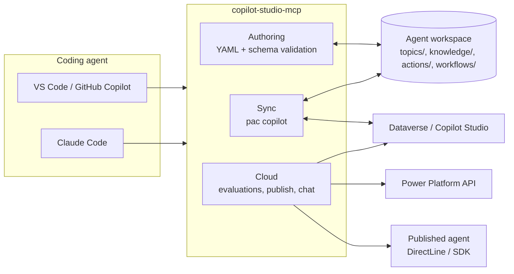
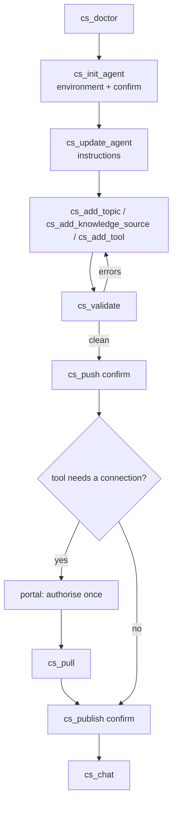
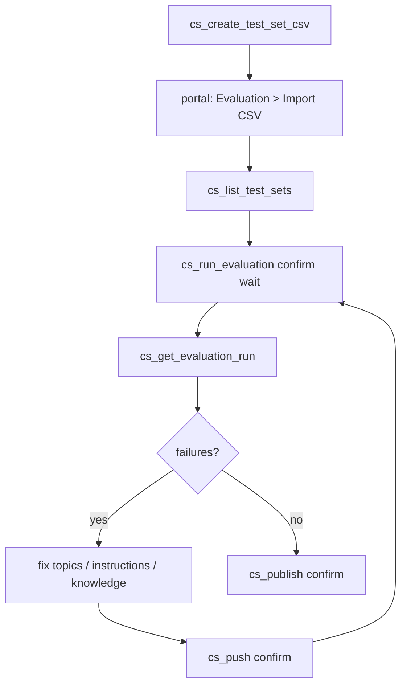

# copilot-studio-mcp

An MCP server that lets a coding agent in VS Code (GitHub Copilot agent mode) or Claude Code do
Microsoft Copilot Studio agent development from the terminal: scaffold or clone an agent, add
topics, knowledge sources, tools (connector / MCP / flow), flows and triggers as YAML, validate,
push and publish, run evaluations, and chat-test the published agent.

It wraps the official Power Platform CLI (`pac copilot`) for sync, writes the same YAML workspace
the Copilot Studio VS Code extension uses, and calls the Power Platform, Dataverse, BAP and
DirectLine APIs directly for everything the CLI does not cover.

## What is and is not possible (feasibility summary)

| Capability | How | Status |
| --- | --- | --- |
| Agent as files, sync both ways | `pac copilot init / clone / pull / push / pack / publish` | official, GA |
| Topics, knowledge, tools, triggers, flows as YAML | workspace layout of the VS Code extension and `pac copilot push` | official |
| Local validation | JSON schema from microsoft/skills-for-copilot-studio (MIT) + structural checks | this server |
| Run evaluations, read results | Power Platform API `makerevaluation` endpoints | official, GA, standard harness |
| Chat with the published agent | DirectLine v3 (no-auth / manual-auth agents) or Copilot Studio client SDK (Entra SSO) | official |
| Publish | `pac copilot publish` or Dataverse `PvaPublish` | official |

Hard limits the server works around rather than hides:

1. **Evaluation test sets cannot be created through the API.** `cs_create_test_set_csv` writes
   the CSV the portal imports (max 100 cases); after one import, runs and results are automated.
2. **Connector, MCP and prompt tools need a connection that only the portal can authorise.**
   `cs_add_tool` writes the YAML and the connection-reference stub and returns the portal step.
3. **Evaluations and topic YAML are standard-harness features.** GitHub Copilot harness agents
   (`--authoring-mode cli-copilot`) get init / pack / import / instructions / chat only.

Verified offline against pac 2.11.2: `pac copilot pack` on a workspace created by `pac copilot init`
(without `--environment`) packages **settings, agent and topics only** and rejects `knowledge/`,
`actions/`, `tools/`, `trigger/`, `variables/`, `workflows/` and `connectionreferences.mcs.yml`.
Those folders are handled by `pac copilot push` from a sync-connected workspace (clone, or init
with `--environment`). The authoring tools tell you when you are in a pack-only workspace.

## Prerequisites

- Node.js 20+
- .NET 10 SDK and the Power Platform CLI: `dotnet tool install --global Microsoft.PowerApps.CLI.Tool`
  (if the SDK is installed in your user profile, set `DOTNET_ROOT` to that folder; the server
  defaults it to `~/.dotnet` when present)
- For sync commands: a pac auth profile, created interactively once: `pac auth create --environment <id or URL>`
- For cloud tools (evaluations, environments, publish via Dataverse, chat): an Entra sign-in via
  `cs_login`. By default the first-party VS Code client id is used (no app registration needed);
  set `CPS_CLIENT_ID` to use your own. Entra-SSO agents additionally need your own app registration
  with the delegated permission `CopilotStudio.Copilots.Invoke` for `cs_chat`.

## Install and register

```sh
git clone https://github.com/jgt87/copilot-studio-mcp.git
cd copilot-studio-mcp
npm install
npm run build
```

VS Code (`.vscode/mcp.json` in your workspace, or the user-level `mcp.json`):

```json
{
  "servers": {
    "copilot-studio": {
      "type": "stdio",
      "command": "node",
      "args": ["<path-to-this-repo>/dist/index.js"],
      "env": { "CPS_WORKSPACE": "${workspaceFolder}" }
    }
  }
}
```

Claude Code (user scope):

```sh
claude mcp add-json copilot-studio '{"type":"stdio","command":"node","args":["<path-to-this-repo>/dist/index.js"]}' --scope user
```

Environment variables (all optional): `CPS_WORKSPACE`, `CPS_TENANT_ID`, `CPS_CLIENT_ID`,
`CPS_ENVIRONMENT_ID`, `CPS_ENVIRONMENT_URL`, `CPS_AGENT_ID`, `CPS_CACHE_DIR`, `PAC_PATH`, `DOTNET_ROOT`.

## Tools

Setup and sync (pac)

| Tool | Purpose |
| --- | --- |
| `cs_doctor` | pac / .NET / auth profiles / sign-in / workspace detection |
| `cs_login`, `cs_login_status`, `cs_logout` | MSAL sign-in (interactive or device code) for the cloud tools |
| `cs_list_environments`, `cs_list_agents` | environments (BAP) and agents (pac or Dataverse) |
| `cs_init_agent` | `pac copilot init` (classic or cli-copilot), optional bootstrap into an environment |
| `cs_clone_agent`, `cs_pull`, `cs_push`, `cs_status` | sync a live agent with the workspace |
| `cs_pack`, `cs_import_solution`, `cs_publish` | package, import, publish |
| `cs_pac` | run any pac command (read-only ones immediately, others with `confirm`) |

Solutions (pull everything, redeploy 1:1 into another environment)

| Tool | Purpose |
| --- | --- |
| `cs_list_solutions`, `cs_list_connections` | solutions in an environment; connections available in a target environment |
| `cs_describe_solution` | export + unpack + inventory: agents, bot components, flows, connection references, environment variables, custom connectors |
| `cs_pull_solution` | export (unmanaged and managed), unpack to `src/`, write `solution.json`, create `deployment-settings.json`, clone every agent into `agents/` |
| `cs_create_deployment_settings` | map connection references to target connection ids and set environment variable values |
| `cs_pack_solution`, `cs_deploy_solution` | pack an edited `src/`; import into the target with the settings file and publish each agent (`confirm`) |

Authoring (files, schema-validated)

| Tool | Purpose |
| --- | --- |
| `cs_describe_workspace` | inventory of settings, topics, knowledge, tools, flows, triggers, variables |
| `cs_validate` | structural + cross-file validation; `cs_push` runs it first |
| `cs_lookup_schema` | inspect the YAML schema (summaries, resolved definitions, kinds) |
| `cs_add_topic` | topic from a declarative spec (phrases + message/question/condition/redirect/http/flow nodes) |
| `cs_add_knowledge_source` | public website, SharePoint, Graph connector, or files |
| `cs_add_tool` | connector action, MCP server, or cloud flow tool (+ connection-reference stub) |
| `cs_add_flow` | experimental cloud-flow scaffold (`workflows/<Name>/metadata.yaml` + `workflow.json`) |
| `cs_add_trigger`, `cs_add_variable` | event trigger for a flow; global variable |
| `cs_update_agent`, `cs_update_settings` | instructions, conversation starters, model, settings |

Evaluation and testing (cloud)

| Tool | Purpose |
| --- | --- |
| `cs_create_test_set_csv` | CSV for the portal's Evaluation import, optionally suggested from the workspace |
| `cs_list_test_sets`, `cs_run_evaluation`, `cs_get_evaluation_run`, `cs_list_evaluation_runs` | Power Platform API evaluations with pass/fail summaries |
| `cs_chat` | one utterance to the published agent (DirectLine or SDK), multi-turn via `conversationId` |
| `cs_run_conversation_tests` | YAML test file of utterances + expectations, run through `cs_chat` |

Every tool that mutates a live environment (`cs_push`, `cs_publish`, `cs_import_solution`,
`cs_run_evaluation`, bootstrap `cs_init_agent`, non-read-only `cs_pac`) returns a dry run unless
called with `confirm: true`.

## How it fits together



## Typical flows

All diagrams, including existing-agent sync, chat routing and the connection step for tools, are in
[docs/flows.md](docs/flows.md).

New agent (standard harness):



Evaluation loop (test sets are imported once in the portal; runs and results are automated):



Existing agent: `cs_clone_agent` -> edit -> `cs_pull` -> `cs_validate` -> `cs_push confirm`.

Whole solution to another environment: `cs_pull_solution` -> `cs_list_connections` (target) ->
`cs_create_deployment_settings` -> `cs_deploy_solution confirm`.

### Caveats when moving a solution between environments

No tooling removes these; plan for them before calling the copy "1:1":

- **Connections are not part of a solution.** A solution carries connection *references*; the
  connections themselves (the authorised links to SharePoint, Outlook, Dataverse, MCP servers, ...)
  must already exist in the target environment, created and consented by a user there. The
  deployment settings file maps each connection reference to one of those connection ids.
  `cs_deploy_solution` refuses to import while any reference is unmapped unless you pass
  `allowUnmapped: true`; in that case the tools stay unbound until someone binds them in the portal.
- **Cloud flows land switched off** when their connection references cannot be resolved. Bind the
  connections, then turn the flows on in the target.
- **Environment variables need target values.** The settings file lists every variable; leave a value
  empty and the target inherits the default from the solution, which is usually a dev value.
- **Who can use the agent is per environment.** The settings file has a `CopilotAgents` section with
  an `AadGroupId` per agent (verified with pac 2.11.2). Map it to the Entra security group for the
  target (`copilotAgents` in `cs_create_deployment_settings`) or set access in the target portal after
  import; an all-zero id means no group is set.
- **Some agent content lives outside the solution.** Uploaded knowledge files, Dataverse tables used as
  knowledge, SharePoint permissions, and channel configuration (Teams, web, Microsoft 365 Copilot)
  are environment-specific. After import, check knowledge sources and re-publish to channels in the
  target portal.
- **Agents must be published in the target.** Importing makes the definition exist; `cs_deploy_solution`
  runs `pac copilot publish` for each agent afterwards (`publishAgents`, default on).
- **Managed vs unmanaged.** `cs_pull_solution` exports both. Deploy managed for downstream
  environments (test, production) and keep unmanaged only for development environments; a managed
  import cannot be edited in place in the target.
- **Per-agent sync does not cross environments.** Workspaces from `cs_clone_agent` or
  `cs_pull_solution` push back to their source environment only. Solution export/import is the
  vehicle for moving; edit the `agents/<name>` workspace, push to the source, then pull and deploy
  the solution again.

## Development

```sh
npm test                      # build + unit tests (fixtures, no network)
node scripts/smoke.mjs        # drive the built server over stdio
node scripts/oracle-pack.mjs  # pac copilot init + authoring tools + pac copilot pack
```

`reference/bot.schema.yaml-authoring.json` and `reference/templates` come from
microsoft/skills-for-copilot-studio (MIT, see `reference/LICENSE.skills-for-copilot-studio.txt`).
Fixtures under `test/fixtures/pac-*` were generated with `pac copilot init`.

MIT licensed.
