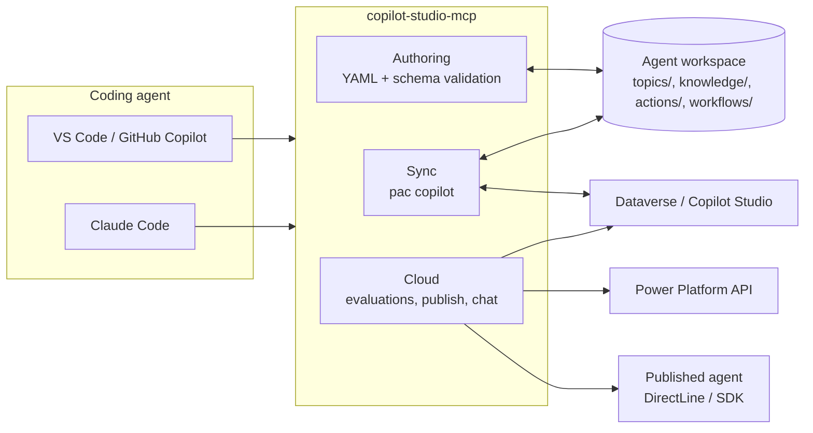
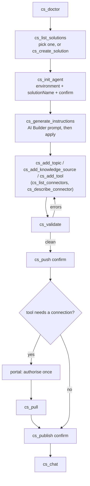
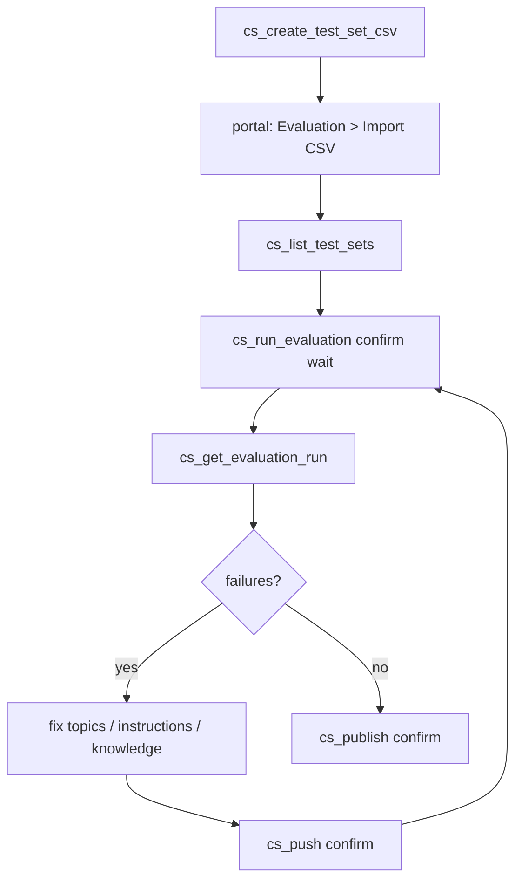

# copilot-studio-mcp

An MCP server that lets a coding agent in VS Code (GitHub Copilot agent mode) or Claude Code do
Microsoft Copilot Studio agent development from the terminal: scaffold or clone an agent, add
topics, knowledge sources, tools (connector / MCP / flow), flows and triggers as YAML, validate,
push and publish, run evaluations, and chat-test the published agent.

It wraps the official Power Platform CLI (`pac copilot`) for sync, writes the same YAML workspace
the Copilot Studio VS Code extension uses, and calls the Power Platform, Dataverse, BAP and
DirectLine APIs directly for everything the CLI does not cover.

## What is and is not possible (feasibility summary)

| Capability | How | Status |
| --- | --- | --- |
| Agent as files, sync both ways | `pac copilot init / clone / pull / push / pack / publish` | official, GA |
| Topics, knowledge, tools, triggers, flows as YAML | workspace layout of the VS Code extension and `pac copilot push` | official |
| Local validation | JSON schema from microsoft/skills-for-copilot-studio (MIT) + structural checks | this server |
| Run evaluations, read results | Power Platform API `makerevaluation` endpoints | official, GA, standard harness |
| Chat with the published agent | DirectLine v3 (no-auth / manual-auth agents) or Copilot Studio client SDK (Entra SSO) | official |
| Publish | `pac copilot publish` or Dataverse `PvaPublish` | official |

Hard limits the server works around rather than hides:

1. **Evaluation test sets cannot be created through the API.** `cs_create_test_set_csv` writes
   the CSV the portal imports (max 100 cases); after one import, runs and results are automated.
2. **Connector, MCP and prompt tools need a connection that only the portal can authorise.**
   `cs_add_tool` writes the YAML and the connection-reference stub and returns the portal step.
3. **Evaluations and topic YAML are standard-harness features.** GitHub Copilot harness agents
   (`--authoring-mode cli-copilot`) get init / pack / import / instructions / chat only.

Verified offline against pac 2.11.2: `pac copilot pack` on a workspace created by `pac copilot init`
(without `--environment`) packages **settings, agent and topics only** and rejects `knowledge/`,
`actions/`, `tools/`, `trigger/`, `variables/`, `workflows/` and `connectionreferences.mcs.yml`.
Those folders are handled by `pac copilot push` from a sync-connected workspace (clone, or init
with `--environment`). The authoring tools tell you when you are in a pack-only workspace.

## Prerequisites

- Node.js 20+
- .NET 10 SDK and the Power Platform CLI: `dotnet tool install --global Microsoft.PowerApps.CLI.Tool`
  (if the SDK is installed in your user profile, set `DOTNET_ROOT` to that folder; the server
  defaults it to `~/.dotnet` when present)
- For sync commands: a pac auth profile, created interactively once: `pac auth create --environment <id or URL>`
- For cloud tools (evaluations, environments, publish via Dataverse, chat): an Entra sign-in via
  `cs_login`. By default the first-party VS Code client id is used (no app registration needed);
  see [Authentication and app registration](#authentication-and-app-registration) for when you
  need your own and which permissions it must have.

## Authentication and app registration

The server signs users in with an MSAL **public client** (interactive browser or device code). It
never uses client secrets, so every permission it needs is a **delegated** permission acting as the
signed-in user. Application permissions are listed below only where Microsoft offers them, for
people who build a headless pipeline on top of the same APIs.

Do you need your own app registration?

| Situation | App registration needed? |
| --- | --- |
| `pac` commands (`cs_init_agent`, `cs_clone_agent`, `cs_pull`, `cs_push`, `cs_pack`, `cs_publish` via pac, all `cs_*_solution` tools) | No. `pac auth create` signs in with Microsoft's own first-party app. |
| Cloud tools with the default client id (`cs_list_environments`, `cs_list_agents` via Dataverse, `cs_publish` via Dataverse, evaluations, `cs_chat` for no-auth or manual-auth agents) | No. The server uses the first-party VS Code client id `51f81489-12ee-4a9e-aaae-a2591f45987d`, which is pre-authorised for Power Platform API, Dataverse and the Power Apps service. Microsoft's own Copilot Studio tooling uses the same id. |
| Same tools, but your tenant blocks that id (app consent policy, conditional access, "user assignment required") | Yes. Create the registration below and set `CPS_CLIENT_ID`. |
| `cs_chat` with an agent that uses **integrated authentication (Entra SSO)** | Yes, always. The first-party id does not carry `CopilotStudio.Copilots.Invoke` for third parties. Pass `clientId` to `cs_chat` or set `CPS_CLIENT_ID`. |
| Headless CI (service principal, no user) | Not supported by this server today (public client only). For pipelines use `pac auth create --applicationId ... --clientSecret ...` with a Dataverse application user, or the Power Platform API with an RBAC role assigned to the service principal. |

Permissions for your own app registration (Entra ID > App registrations > API permissions > "APIs my organization uses"):

| Used by | API to pick in Entra | Permission | Delegated or application | Notes |
| --- | --- | --- | --- | --- |
| `cs_chat` (transport `sdk`, Entra-SSO agents) | **Power Platform API** (app id `8578e004-a5c6-46e7-913e-12f58912df43`) | `CopilotStudio.Copilots.Invoke` | Delegated is what this server uses. An application permission of the same name exists for confidential clients (Microsoft 365 Agents SDK); not used here. | Admin consent is normally required. Redirect URI `http://localhost` (Mobile and desktop applications). |
| `cs_list_test_sets`, `cs_run_evaluation`, `cs_get_evaluation_run`, `cs_list_evaluation_runs` | **Power Platform API** | Token scope `https://api.powerplatform.com/.default`. The evaluation endpoints declare only `.default`; the permission reference has no finer-grained evaluation permission. | Delegated only. Power Platform API has no application permissions; service principals get access through RBAC roles instead. | Verified with the first-party id by Microsoft's own tooling. Not yet verified with a custom registration; if calls return 403, the signed-in user needs maker access to the agent. |
| `cs_list_environments`, automatic Dataverse URL lookup, `cs_list_connectors`, `cs_describe_connector` | **PowerApps Service** (app id `475226c6-020e-4fb2-8a90-7a972cbfc1d4`) | `User` ("Access the Power Apps Service API") | Delegated. | Calls the BAP environments API (`api.bap.microsoft.com`) and the connector registry (`api.powerapps.com`). |
| `cs_list_agents` (via `dataverse`), `cs_publish` (via `dataverse`), authentication-mode detection in `cs_chat` | **Dynamics CRM** (Dataverse, app id `00000007-0000-0000-c000-000000000000`) | `user_impersonation` | Delegated. There is no application permission; server-to-server access to Dataverse means an **application user** with a security role in each environment. | The user still needs a Dataverse security role that can read and publish bots (System Customizer or a Copilot Studio maker role). |
| `cs_chat` for no-auth or manual-auth agents (DirectLine) | none | none | not applicable | The DirectLine token endpoint of a published agent is anonymous. |
| `pac` interactive sign-in | none | none | not applicable | Microsoft's own app; `pac auth create --environment <id>`. |

Steps for your own registration:

1. Entra ID > App registrations > New registration. Single tenant. Under **Authentication** add the
   platform **Mobile and desktop applications** with redirect URI `http://localhost` (the loopback
   MSAL uses for `cs_login` interactive). Set **Allow public client flows** to Yes if you plan to use
   `cs_login` with `mode: device_code`.
2. Add the permissions from the table. If **Power Platform API** does not appear when you search
   by name or by the id above, its service principal is missing from your tenant; create it with
   `az ad sp create --id 8578e004-a5c6-46e7-913e-12f58912df43` (or
   `New-MgServicePrincipal -AppId 8578e004-a5c6-46e7-913e-12f58912df43`) and search again.
3. **Grant admin consent** for the tenant, or let each user consent interactively on first sign-in.
4. Put the ids in the MCP server environment: `CPS_CLIENT_ID=<application (client) id>` and
   `CPS_TENANT_ID=<directory (tenant) id>`. `cs_chat` also accepts `clientId` per call.

## Install and register

```sh
git clone https://github.com/jgt87/copilot-studio-mcp.git
cd copilot-studio-mcp
npm install
npm run build
```

VS Code (`.vscode/mcp.json` in your workspace, or the user-level `mcp.json`):

```json
{
  "servers": {
    "copilot-studio": {
      "type": "stdio",
      "command": "node",
      "args": ["<path-to-this-repo>/dist/index.js"],
      "env": { "CPS_WORKSPACE": "${workspaceFolder}" }
    }
  }
}
```

Claude Code (user scope):

```sh
claude mcp add-json copilot-studio '{"type":"stdio","command":"node","args":["<path-to-this-repo>/dist/index.js"]}' --scope user
```

Environment variables (all optional): `CPS_WORKSPACE`, `CPS_TENANT_ID`, `CPS_CLIENT_ID`,
`CPS_ENVIRONMENT_ID`, `CPS_ENVIRONMENT_URL`, `CPS_AGENT_ID`, `CPS_CACHE_DIR`, `PAC_PATH`, `DOTNET_ROOT`.

## Tools

Setup and sync (pac)

| Tool | Purpose |
| --- | --- |
| `cs_doctor` | pac / .NET / auth profiles / sign-in / workspace detection |
| `cs_login`, `cs_login_status`, `cs_logout` | MSAL sign-in (interactive or device code) for the cloud tools |
| `cs_list_environments`, `cs_list_agents` | environments (BAP) and agents (pac or Dataverse) |
| `cs_init_agent` | `pac copilot init` (classic or cli-copilot), optional bootstrap into an environment, optionally inside a chosen or new solution |
| `cs_create_solution` | create an unmanaged solution (and publisher) as the container for new agents |
| `cs_generate_instructions` | draft or refine the agent instructions with an AI Builder prompt (`pac copilot model predict`) and write them into the workspace |
| `cs_clone_agent`, `cs_pull`, `cs_push`, `cs_status` | sync a live agent with the workspace |
| `cs_pack`, `cs_import_solution`, `cs_publish` | package, import, publish |
| `cs_pac` | run any pac command (read-only ones immediately, others with `confirm`) |

Solutions (pull everything, redeploy 1:1 into another environment)

| Tool | Purpose |
| --- | --- |
| `cs_list_solutions`, `cs_list_connections` | solutions in an environment; connections available in a target environment |
| `cs_describe_solution` | export + unpack + inventory: agents, bot components, flows, connection references, environment variables, custom connectors |
| `cs_pull_solution` | export (unmanaged and managed), unpack to `src/`, write `solution.json`, create `deployment-settings.json`, clone every agent into `agents/` |
| `cs_create_deployment_settings` | map connection references to target connection ids and set environment variable values |
| `cs_pack_solution`, `cs_deploy_solution` | pack an edited `src/`; import into the target with the settings file and publish each agent (`confirm`) |

Environment comparison (DTAP)

| Tool | Purpose |
| --- | --- |
| `cs_snapshot_environment` | capture one environment into a folder: solution version, every agent cloned, flows, connection references, environment variables, publish state |
| `cs_compare_snapshots` | offline diff of two snapshots with a Markdown + JSON report; `failOnDrift` for pipeline gates |
| `cs_compare_environments` | snapshot an ordered chain (DEV, TEST, ACC, PROD) and compare each adjacent pair |

Authoring (files, schema-validated)

| Tool | Purpose |
| --- | --- |
| `cs_describe_workspace` | inventory of settings, topics, knowledge, tools, flows, triggers, variables |
| `cs_validate` | structural + cross-file validation; `cs_push` runs it first |
| `cs_lookup_schema` | inspect the YAML schema (summaries, resolved definitions, kinds) |
| `cs_add_topic` | topic from a declarative spec (phrases + message/question/condition/redirect/http/flow nodes) |
| `cs_add_knowledge_source` | public website, SharePoint, Graph connector, or files |
| `cs_add_tool` | connector action, MCP server, cloud flow, AI Builder prompt, connected agent, child agent, or any other TaskAction kind as raw (+ connection-reference stub) |
| `cs_list_connectors`, `cs_describe_connector`, `cs_list_prompts` | tool catalog: connectors available in the environment (with MCP detection), a connector's operations and parameters, AI Builder prompts |
| `cs_add_flow` | experimental cloud-flow scaffold (`workflows/<Name>/metadata.yaml` + `workflow.json`) |
| `cs_add_trigger`, `cs_add_variable` | event trigger for a flow; global variable |
| `cs_update_agent`, `cs_update_settings` | instructions, conversation starters, model, settings |

Evaluation and testing (cloud)

| Tool | Purpose |
| --- | --- |
| `cs_create_test_set_csv` | CSV for the portal's Evaluation import, optionally suggested from the workspace |
| `cs_list_test_sets`, `cs_run_evaluation`, `cs_get_evaluation_run`, `cs_list_evaluation_runs` | Power Platform API evaluations with pass/fail summaries |
| `cs_chat` | one utterance to the published agent (DirectLine or SDK), multi-turn via `conversationId` |
| `cs_run_conversation_tests` | YAML test file of utterances + expectations, run through `cs_chat` |

Every tool that mutates a live environment (`cs_push`, `cs_publish`, `cs_import_solution`,
`cs_run_evaluation`, bootstrap `cs_init_agent`, non-read-only `cs_pac`) returns a dry run unless
called with `confirm: true`.

## Getting started: building a new agent

The end-to-end flow for a new standard-harness agent, from an empty folder to a published agent you
can talk to. Every step is one tool call; steps that change the environment need `confirm: true`.

1. **Check the machine.** `cs_doctor` reports pac, .NET, the pac auth profile and sign-in state. If
   there is no profile, run `pac auth create --environment <id or URL>` once in a terminal.
2. **Pick the environment.** `cs_list_environments` (needs `cs_login`) or use the environment id
   from the Copilot Studio URL.
3. **Pick or create the solution.** `cs_list_solutions` shows what exists. To start a new default
   solution for your agents: `cs_create_solution uniqueName=contoso_Agents publisherPrefix=contoso
   confirm=true`. An existing solution works as long as it is unmanaged and you use its publisher
   prefix.
4. **Create the agent inside that solution.**
   `cs_init_agent name="Contoso Support" publisherPrefix=contoso projectDir=./contoso-support
   environment=<id> solutionName=contoso_Agents confirm=true` (add `createSolution=true` to do step 3
   in the same call). The tool scaffolds locally, packs with the solution name, imports, then clones
   the live agent back so `projectDir` is a sync-connected workspace. Without `solutionName`, pac
   puts the agent in a solution named after the agent.
5. **Generate the first instructions with an AI Builder prompt.** `cs_list_prompts` shows the
   prompts and models in the environment; create a "write agent instructions" prompt once in AI
   Builder if you do not have one. Then
   `cs_generate_instructions purpose="Answer IT questions and create ServiceNow tickets"
   audience="Employees" tone="Friendly, brief" boundaries=["never reset passwords"]
   modelName="Agent instructions"`. Review the text; call again with `apply=true` to write it into
   `agent.mcs.yml`. Later, `refine=true` with a `changeRequest` revises what is there. AI Builder
   capacity applies per run.
6. **Add what the agent can do.** `cs_add_knowledge_source` (public site, SharePoint, Graph
   connector, files), `cs_add_topic` for deterministic conversations, and `cs_add_tool`. For tools,
   find the connector and operation first: `cs_list_connectors search=ServiceNow`, then
   `cs_describe_connector connector=shared_service-now operation=incident`; with the definition
   cached the tool call checks the operation and fills the inputs.
7. **Validate and push.** `cs_validate`, then `cs_push confirm=true`. Tools with a connection
   reference need one portal step: authorise the connection under the agent's Tools, then `cs_pull`.
8. **Publish and try it.** `cs_publish confirm=true`, then `cs_chat utterance="my laptop is slow"`.
   `cs_run_conversation_tests` turns a few of those into a repeatable check.
9. **Evaluate.** `cs_create_test_set_csv suggestFromWorkspace=true`, import the CSV once in the
   portal's Evaluation tab, then `cs_run_evaluation confirm=true wait=true` and
   `cs_get_evaluation_run`.

When the agent later moves to test and production, continue with the solution flow (`cs_pull_solution`,
`cs_create_deployment_settings`, `cs_deploy_solution`) and the DTAP comparison below.

## Tool catalog: knowing what an agent can use

Copilot Studio agents can call any connector in the environment (more than a thousand
Microsoft-published ones plus custom connectors), MCP servers exposed through connectors, cloud
flows, AI Builder prompts, other agents, and a few rarer kinds. The server keeps that scope in two
ways.

**Kinds of tool** come from the YAML schema, which lists every `TaskAction` kind. `cs_add_tool`
offers a typed spec for connector, MCP, flow, prompt, connected agent and child agent, and a `raw`
type for the rest (AI plugin, Bot Framework skill, client action, computer-use agent). A unit test
compares the schema with that table, so a schema update that introduces a new kind fails the build
until the kind is classified.

**Instances** come from the environment, which is the only source that knows what exists there:

| Tool | Source | Cached at |
| --- | --- | --- |
| `cs_list_connectors` | the environment's connector registry (Power Apps API), the same list the portal's Add a tool shows; MCP servers flagged | `.cs-catalog/<environment>/connectors.json` |
| `cs_describe_connector` | the connector's OpenAPI definition, turned into operations with `operationId`, required and optional parameters, response fields; `x-ms-agentic-protocol: mcp-streamable-1.0` marks MCP endpoints | `.cs-catalog/<environment>/connectors/<name>.json` |
| `cs_list_prompts` | `pac copilot model list` | not cached |
| flows, agents | `cs_describe_solution`, `cs_list_agents`, Dataverse reads in snapshots | |

Once a connector definition is cached, `cs_add_tool` checks the `operationId`, fills the automatic
inputs from the operation's required parameters, and `cs_validate` warns about tool files whose
operation is not in the definition. Without a sign-in, `cs_list_connectors` falls back to an offline
seed generated from the public connector reference (display name to `shared_` id, no operations);
the seed is a starting point, not proof that a connector is enabled in your environment.

The registry calls use the same PowerApps Service permission as environment listing (see the
authentication section) and, like the other cloud calls, have not been verified against a tenant yet.

## How it fits together



## Typical flows

All diagrams, including existing-agent sync, chat routing and the connection step for tools, are in
[docs/flows.md](docs/flows.md).

New agent (standard harness):



Evaluation loop (test sets are imported once in the portal; runs and results are automated):



Existing agent: `cs_clone_agent` -> edit -> `cs_pull` -> `cs_validate` -> `cs_push confirm`.

Whole solution to another environment: `cs_pull_solution` -> `cs_list_connections` (target) ->
`cs_create_deployment_settings` -> `cs_deploy_solution confirm`.

### Caveats when moving a solution between environments

No tooling removes these; plan for them before calling the copy "1:1":

- **Connections are not part of a solution.** A solution carries connection *references*; the
  connections themselves (the authorised links to SharePoint, Outlook, Dataverse, MCP servers, ...)
  must already exist in the target environment, created and consented by a user there. The
  deployment settings file maps each connection reference to one of those connection ids.
  `cs_deploy_solution` refuses to import while any reference is unmapped unless you pass
  `allowUnmapped: true`; in that case the tools stay unbound until someone binds them in the portal.
- **Cloud flows land switched off** when their connection references cannot be resolved. Bind the
  connections, then turn the flows on in the target.
- **Environment variables need target values.** The settings file lists every variable; leave a value
  empty and the target inherits the default from the solution, which is usually a dev value.
- **Who can use the agent is per environment.** The settings file has a `CopilotAgents` section with
  an `AadGroupId` per agent (verified with pac 2.11.2). Map it to the Entra security group for the
  target (`copilotAgents` in `cs_create_deployment_settings`) or set access in the target portal after
  import; an all-zero id means no group is set.
- **Some agent content lives outside the solution.** Uploaded knowledge files, Dataverse tables used as
  knowledge, SharePoint permissions, and channel configuration (Teams, web, Microsoft 365 Copilot)
  are environment-specific. After import, check knowledge sources and re-publish to channels in the
  target portal.
- **Agents must be published in the target.** Importing makes the definition exist; `cs_deploy_solution`
  runs `pac copilot publish` for each agent afterwards (`publishAgents`, default on).
- **Managed vs unmanaged.** `cs_pull_solution` exports both. Deploy managed for downstream
  environments (test, production) and keep unmanaged only for development environments; a managed
  import cannot be edited in place in the target.
- **Per-agent sync does not cross environments.** Workspaces from `cs_clone_agent` or
  `cs_pull_solution` push back to their source environment only. Solution export/import is the
  vehicle for moving; edit the `agents/<name>` workspace, push to the source, then pull and deploy
  the solution again.

## Comparing environments in a DTAP pipeline

When the same solution is promoted through development, test, acceptance and production, the
question is whether each stage still holds what the previous one holds. The platform has no
cross-environment diff, but every input is reachable, so the server captures each environment into a
**snapshot folder** and compares snapshots offline.

### The process

1. **Snapshot each stage** with `cs_snapshot_environment` (or all at once with
   `cs_compare_environments`). A snapshot folder contains:

   ```
   snapshots/TEST/
     snapshot.json         label, environment, time, solution version and managed flag,
                           agents with publish state, flows, connection references,
                           environment variables, notes
     agents/<Agent name>/  the agent as YAML, from pac copilot clone
   ```

   Agents are cloned with `pac copilot clone` rather than exported as a solution, because a managed
   solution cannot be exported from test or production. Clone is a read operation and is expected to
   work on managed agents; that has not been verified live yet (see caveats). Flows, connection
   references, environment variables and publish state come from Dataverse and are included when
   you are signed in with `cs_login`; otherwise the snapshot notes that they were skipped.
2. **Compare adjacent stages** with `cs_compare_snapshots` (DEV vs TEST, TEST vs ACC, ACC vs PROD).
   Each comparison writes `<A>-vs-<B>.md` and `.json`.
3. **Read the verdict.** A report starts with `DRIFT` or `no drift`, then lists the drift, the
   expected differences, and tables per layer with unified diffs for changed agent files.
4. **Act on it.** Drift in agent YAML means the later stage is behind or was edited in place: promote
   again with the solution flow above. Unbound connection references, missing flows, or variables
   without a value are deployment-settings problems: fix the settings file and redeploy.
5. **Keep history.** Snapshot folders are plain files; commit them (without `.mcs/` state) to get
   a timeline per stage.

### What counts as drift, and what is expected

| Layer | Drift | Expected difference (reported, not drift) |
| --- | --- | --- |
| Solution | version differs, missing in a stage | managed in later stages, unmanaged in development |
| Agent YAML (topics, instructions, knowledge, tools, triggers, variables) | any changed, added or removed file after normalisation | ids, audit info, version fields, connection ids inside `connectionreferences.mcs.yml` (removed before diffing) |
| Publish state | modified after last publish in any stage (unpublished changes) | |
| Flows | missing in a stage, on/off state differs | |
| Connection references | missing, connector differs, unbound in a stage | bound to a different connection per stage |
| Environment variables | missing, no value in a stage | different values per stage (drift only with `strictVariables`) |
| Authentication mode | differs between stages | |

### Pipeline gate

`cs_compare_snapshots` and `cs_compare_environments` accept `failOnDrift`; the tool result is then
an error, which a scripted MCP client or a pipeline step can turn into a failed job. A typical gate
before promoting TEST to ACC:

```
cs_snapshot_environment label=TEST environment=<test id> dir=snapshots/TEST solution=<name>
cs_snapshot_environment label=ACC  environment=<acc id>  dir=snapshots/ACC  solution=<name>
cs_compare_snapshots a=snapshots/TEST b=snapshots/ACC failOnDrift=true
```

### Caveats

- All stages must be reachable from the active pac auth profile (same tenant). For chains that span
  tenants, run `pac auth select` between stages and snapshot them one by one.
- Whether `pac copilot clone` succeeds on a managed agent has not been verified live yet (see
  docs/STATUS.md); if it refuses, the fallback is reading the same component definitions through the
  Dataverse Web API.
- Uploaded knowledge files and channel configuration are environment-specific and outside the
  cloned YAML; the snapshot lists files by name and size only.
- Without a Dataverse sign-in the comparison covers solution version and agent YAML only; the
  report says so in its notes.

## Development

```sh
npm test                      # build + unit tests (fixtures, no network)
node scripts/smoke.mjs        # drive the built server over stdio
node scripts/oracle-pack.mjs  # pac copilot init + authoring tools + pac copilot pack
```

`reference/bot.schema.yaml-authoring.json` and `reference/templates` come from
microsoft/skills-for-copilot-studio (MIT, see `reference/LICENSE.skills-for-copilot-studio.txt`).
Fixtures under `test/fixtures/pac-*` were generated with `pac copilot init`.

MIT licensed.
