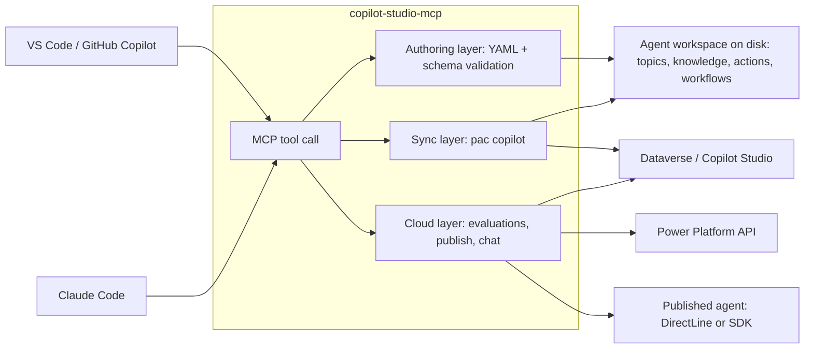
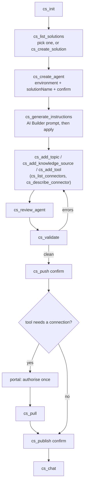
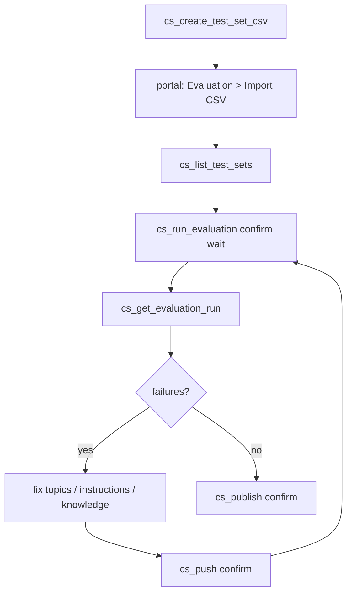

# copilot-studio-mcp

An MCP server that lets a coding agent in VS Code (GitHub Copilot agent mode) or Claude Code do
Microsoft Copilot Studio agent development from the terminal: scaffold or clone an agent, add
topics, knowledge sources, tools (connector / MCP / flow), flows and triggers as YAML, validate,
push and publish, run evaluations, and chat-test the published agent.

It wraps the official Power Platform CLI (`pac copilot`) for sync, writes the same YAML workspace
the Copilot Studio VS Code extension uses, and calls the Power Platform, Dataverse, BAP and
DirectLine APIs directly for everything the CLI does not cover.

## How this differs from Microsoft's own pac MCP server

The Power Platform CLI ships a built-in MCP server (`pac copilot mcp --run`, preview, named
"Power Platform Management MCP Server"). It is a natural-language front end to pac itself: each
of its tools runs one pac command. Probed on pac 2.11.2 it exposes 70 tools, of which exactly one
is about Copilot Studio (`copilot_publish`); 51 are tenant administration, managed identity,
model-driven apps and generated pages, Power Pages, code apps and code generation.

| | pac MCP server (`pac copilot mcp`) | copilot-studio-mcp (this repo) |
| --- | --- | --- |
| Purpose | run pac commands in natural language; tenant and environment administration | build, test, ship and maintain Copilot Studio agents from the editor |
| Copilot Studio commands | `copilot_publish` only | init, clone, pull, push, pack, publish, status, list, delete, templates, translations, quarantine, AI Builder instructions |
| Authoring | none | topics, knowledge sources, tools (connector / MCP / flow / prompt / agent), flows, triggers, variables, agent settings as YAML; day-two edit and remove; schema validation (744 definitions); rules-based review with a score |
| Testing | none | evaluation test sets and runs (Power Platform API), chat through DirectLine or the client SDK, local conversation tests |
| ALM | solution list, export, import, check | pull a whole solution with a deployment settings file and redeploy it 1:1, Solution Checker, versioning, staged upgrades, pipelines, DTAP snapshots and comparison |
| Drift | none | portal changes since the last sync (quick Dataverse check, full clone diff) and a push preflight that blocks on conflicts |
| Safety | no dry run in the server; the client's approval prompt is the only gate | every environment-changing tool returns a dry run until `confirm: true`; secrets are masked in logs and results |
| Other pac groups | admin, managed-identity, model, pages, code, modelbuilder as native tools | reachable through `cs_pac` (read-only commands run immediately, others need `confirm`) |
| Sign-in | pac auth profile | pac auth profile, plus MSAL for the APIs pac does not cover (evaluations, Dataverse reads, environments, chat) |
| Tool list | fixed | `CPS_TOOLS` / `CPS_TOOLS_EXCLUDE` trim it per client |

Both are stdio servers and can be registered side by side: pac's for tenant administration, this
one for agent work. One practical note: pac's server prints a non-JSON line on stdout at startup,
which strict MCP clients may reject.

Sources: [Use Power Platform CLI with built-in MCP server](https://learn.microsoft.com/en-us/power-platform/developer/howto/use-mcp)
and a `tools/list` probe of pac 2.11.2 (2026-09-07).

## What is and is not possible (feasibility summary)

| Capability | How | Status |
| --- | --- | --- |
| Agent as files, sync both ways | `pac copilot init / clone / pull / push / pack / publish` | official, GA |
| Topics, knowledge, tools, triggers, flows as YAML | workspace layout of the VS Code extension and `pac copilot push` | official |
| Local validation | JSON schema from microsoft/skills-for-copilot-studio (MIT) + structural checks | this server |
| Run evaluations, read results | Power Platform API `makerevaluation` endpoints | official, GA, standard harness |
| Chat with the published agent | DirectLine v3 (no-auth / manual-auth agents) or Copilot Studio client SDK (Entra SSO) | official |
| Publish | `pac copilot publish` or Dataverse `PvaPublish` | official |

Hard limits the server works around rather than hides:

1. **Evaluation test sets cannot be created through the API.** `cs_create_test_set_csv` writes
   the CSV the portal imports (max 100 cases); after one import, runs and results are automated.
2. **Connector, MCP and prompt tools need a connection that only the portal can authorise.**
   `cs_add_tool` writes the YAML and the connection-reference stub and returns the portal step.
3. **Evaluations and topic YAML are standard-harness features.** GitHub Copilot harness agents
   (`--authoring-mode cli-copilot`) get init / pack / import / instructions / chat only.

Verified offline against pac 2.11.2: `pac copilot pack` on a workspace created by `pac copilot init`
(without `--environment`) packages **settings, agent and topics only** and rejects `knowledge/`,
`actions/`, `tools/`, `trigger/`, `variables/`, `workflows/` and `connectionreferences.mcs.yml`.
Those folders are handled by `pac copilot push` from a sync-connected workspace (clone, or init
with `--environment`). The authoring tools tell you when you are in a pack-only workspace.

## Approval before anything changes

The server never changes a live Copilot Studio environment on its own. Every tool that can
(`cs_push`, `cs_publish`, `cs_run_evaluation`, `cs_import_solution`, `cs_deploy_solution`,
`cs_create_agent` with an environment, the delete tools, and the environment-changing pac wrappers)
returns a **dry run** describing what it would do, and does nothing else, until it is called again
with `confirm: true`. The calling agent is instructed, in the MCP handshake, to show that dry run
and pass `confirm` only after you agree. Writing YAML, editing and validating are local file
operations and need no approval; sending them to Copilot Studio does.

For a hard lock, set `CPS_READ_ONLY=1` in the server's environment: the environment-changing tools
are then not registered at all, so no confirmation can reach the environment, while authoring,
validation, review and the read-only tools keep working. `cs_init` reports the mode and which
tools are withheld. `test/policy.test.js` fails if a tool that declares `confirm` is missing from
that list, so the two layers cannot drift apart.

## Two accounts: maker and admin

Making agents and administering the tenant are usually different accounts. pac keeps one active
authentication profile per machine, so create one profile per account and let the server switch:

```sh
pac auth create --name maker --environment <environment id or url>
pac auth create --name admin --environment <environment id or url>
```

`cs_list_auth_profiles` shows them. Every pac-backed tool takes a `profile` argument; the server
selects that profile, runs the command and restores the previously active one, serialising calls so
two tools cannot fight over it. Set `CPS_ADMIN_PROFILE` (used by the `cs_admin_*` tools and
`cs_backup_tenant`) and `CPS_PAC_PROFILE` (used by the rest) to make that automatic.

The MSAL sign-in used by the API-based tools is separate again, and independent of pac.

## Prerequisites

- Node.js 20+
- .NET 10 SDK and the Power Platform CLI: `dotnet tool install --global Microsoft.PowerApps.CLI.Tool`
  (if the SDK is installed in your user profile, set `DOTNET_ROOT` to that folder; the server
  defaults it to `~/.dotnet` when present)
- For sync commands: a pac auth profile, created interactively once: `pac auth create --environment <id or URL>`
- For cloud tools (evaluations, environments, publish via Dataverse, chat): an Entra sign-in via
  `cs_login`. By default the first-party VS Code client id is used (no app registration needed);
  see [Authentication and app registration](#authentication-and-app-registration) for when you
  need your own and which permissions it must have.

## Authentication and app registration

The server signs users in with an MSAL **public client** (interactive browser or device code). It
never uses client secrets, so every permission it needs is a **delegated** permission acting as the
signed-in user. Application permissions are listed below only where Microsoft offers them, for
people who build a headless pipeline on top of the same APIs.

How sign-in behaves inside an MCP client: `cs_login` starts the browser flow, tries to open the
browser from the server, and returns within `waitSeconds` (default 15). When the token has not
arrived by then the result is `status: pending` with the sign-in URL, so the calling agent can show
it and you can open it yourself on the machine running the server (the page redirects to
`localhost`, where the server is listening, and the login completes in the background;
`cs_login_status` or any cloud tool picks the token up). This is what makes sign-in work from
clients that cap tool-call duration or run the server where no browser can be launched. Device code
(`mode: device_code`) is the alternative where tenants allow it; many tenants block that flow by
Conditional Access policy.

Do you need your own app registration?

| Situation | App registration needed? |
| --- | --- |
| `pac` commands (`cs_create_agent`, `cs_clone_agent`, `cs_pull`, `cs_push`, `cs_pack`, `cs_publish` via pac, `cs_check_drift` in `full` mode, all `cs_*_solution` tools, and every tool in the "Remaining pac commands" table) | No. `pac auth create` signs in with Microsoft's own first-party app. |
| Cloud tools with the default client id (`cs_list_environments`, `cs_list_agents` via Dataverse, `cs_publish` via Dataverse, `cs_check_drift`, evaluations, `cs_chat` for no-auth or manual-auth agents) | No. The server uses the first-party VS Code client id `51f81489-12ee-4a9e-aaae-a2591f45987d`, which is pre-authorised for Power Platform API, Dataverse and the Power Apps service. Microsoft's own Copilot Studio tooling uses the same id. |
| Same tools, but your tenant blocks that id (app consent policy, conditional access, "user assignment required") | Yes. Create the registration below and set `CPS_CLIENT_ID`. |
| `cs_chat` with an agent that uses **integrated authentication (Entra SSO)** | Yes, always. The first-party id does not carry `CopilotStudio.Copilots.Invoke` for third parties. Pass `clientId` to `cs_chat` or set `CPS_CLIENT_ID`. |
| Headless CI (service principal, no user) | Not supported by this server today (public client only). For pipelines use `pac auth create --applicationId ... --clientSecret ...` with a Dataverse application user, or the Power Platform API with an RBAC role assigned to the service principal. |

Permissions for your own app registration (Entra ID > App registrations > API permissions > "APIs my organization uses"):

| Used by | API to pick in Entra | Permission | Delegated or application | Notes |
| --- | --- | --- | --- | --- |
| `cs_chat` (transport `sdk`, Entra-SSO agents) | **Power Platform API** (app id `8578e004-a5c6-46e7-913e-12f58912df43`) | `CopilotStudio.Copilots.Invoke` | Delegated is what this server uses. An application permission of the same name exists for confidential clients (Microsoft 365 Agents SDK); not used here. | Admin consent is normally required. Redirect URI `http://localhost` (Mobile and desktop applications). |
| `cs_list_test_sets`, `cs_run_evaluation`, `cs_get_evaluation_run`, `cs_list_evaluation_runs` | **Power Platform API** | Token scope `https://api.powerplatform.com/.default`. The evaluation endpoints declare only `.default`; the permission reference has no finer-grained evaluation permission. | Delegated only. Power Platform API has no application permissions; service principals get access through RBAC roles instead. | Verified with the first-party id by Microsoft's own tooling. Not yet verified with a custom registration; if calls return 403, the signed-in user needs maker access to the agent. |
| `cs_list_environments`, automatic Dataverse URL lookup, `cs_list_connectors`, `cs_describe_connector` | **PowerApps Service** (app id `475226c6-020e-4fb2-8a90-7a972cbfc1d4`) | `User` ("Access the Power Apps Service API") | Delegated. | Calls the BAP environments API (`api.bap.microsoft.com`) and the connector registry (`api.powerapps.com`). |
| `cs_list_agents` (via `dataverse`), `cs_publish` (via `dataverse`), authentication-mode detection in `cs_chat`, `cs_check_drift` (quick mode), the drift preflight in `cs_push` and the component stamps recorded by `cs_clone_agent` / `cs_pull` / `cs_push` | **Dynamics CRM** (Dataverse, app id `00000007-0000-0000-c000-000000000000`) | `user_impersonation` | Delegated. There is no application permission; server-to-server access to Dataverse means an **application user** with a security role in each environment. | The user still needs a Dataverse security role that can read and publish bots (System Customizer or a Copilot Studio maker role). The drift checks only read the `bot` and `botcomponent` tables, which every maker role can read; they never write to Dataverse. When a workspace has no Dataverse URL in its sync metadata the URL is looked up through the PowerApps Service permission above. |
| `cs_list_flow_runs`, `cs_get_flow_run`, `cs_run_flow` | **Microsoft Flow** (Power Automate service, app id `7df0a125-d3be-4c96-aa54-591f83ff541c`) | `User` (token scope `https://service.flow.microsoft.com/.default`, override with `CPS_FLOW_SCOPE`) | Delegated. | A separate resource from Dataverse and the Power Platform API, so it needs its own consent: sign in with `cs_login scope='flow'`. The signed-in user must be an owner or co-owner of the flow. Endpoints and scope are taken from the service the Power Automate portal calls and are unverified against a tenant. |
| `cs_chat` for no-auth or manual-auth agents (DirectLine) | none | none | not applicable | The DirectLine token endpoint of a published agent is anonymous. |
| `pac` interactive sign-in | none | none | not applicable | Microsoft's own app; `pac auth create --environment <id>`. |

Steps for your own registration:

1. Entra ID > App registrations > New registration. Single tenant. Under **Authentication** add the
   platform **Mobile and desktop applications** with redirect URI `http://localhost` (the loopback
   MSAL uses for `cs_login` interactive). Set **Allow public client flows** to Yes if you plan to use
   `cs_login` with `mode: device_code`.
2. Add the permissions from the table. If **Power Platform API** does not appear when you search
   by name or by the id above, its service principal is missing from your tenant; create it with
   `az ad sp create --id 8578e004-a5c6-46e7-913e-12f58912df43` (or
   `New-MgServicePrincipal -AppId 8578e004-a5c6-46e7-913e-12f58912df43`) and search again.
3. **Grant admin consent** for the tenant, or let each user consent interactively on first sign-in.
4. Put the ids in the MCP server environment: `CPS_CLIENT_ID=<application (client) id>` and
   `CPS_TENANT_ID=<directory (tenant) id>`. `cs_chat` also accepts `clientId` per call.

## Install and register

```sh
git clone https://github.com/jgt87/copilot-studio-mcp.git
cd copilot-studio-mcp
npm install
npm run build
```

VS Code (`.vscode/mcp.json` in your workspace, or the user-level `mcp.json`):

```json
{
  "servers": {
    "copilot-studio": {
      "type": "stdio",
      "command": "node",
      "args": ["<path-to-this-repo>/dist/index.js"],
      "env": { "CPS_WORKSPACE": "${workspaceFolder}" }
    }
  }
}
```

Claude Code (user scope):

```sh
claude mcp add-json copilot-studio '{"type":"stdio","command":"node","args":["<path-to-this-repo>/dist/index.js"]}' --scope user
```

Environment variables (all optional): `CPS_WORKSPACE`, `CPS_TENANT_ID`, `CPS_CLIENT_ID`,
`CPS_ENVIRONMENT_ID`, `CPS_ENVIRONMENT_URL`, `CPS_AGENT_ID`, `CPS_CACHE_DIR`, `PAC_PATH`, `DOTNET_ROOT`,
`CPS_READ_ONLY` (see "Approval before anything changes"), `CPS_ADMIN_PROFILE` and `CPS_PAC_PROFILE`
(see "Two accounts: maker and admin"), `CPS_FLOW_SCOPE`, `CPS_TOOLS` and `CPS_TOOLS_EXCLUDE`. The last two trim the tool list for clients with small context
windows: comma-separated tool names with `*` wildcards, for example
`CPS_TOOLS=cs_init,cs_describe_workspace,cs_add_*,cs_edit_*,cs_review_agent,cs_validate,cs_push,cs_pull`
or `CPS_TOOLS_EXCLUDE=cs_*_pipeline,cs_env_*,cs_*_auth_profile`.

## Tools

Guidance (start here)

| Tool | Purpose |
| --- | --- |
| `cs_guide` | walkthrough for one topic: `getting-started`, `instructions`, `knowledge`, `tools`, `topics`, `evaluations`, `publish-and-test`, `drift`, `solutions`, `troubleshooting`; each names the tool per step and the portal steps that cannot be automated, and ends with next steps for your workspace |

The server also sends usage instructions in the MCP handshake, `cs_init` and
`cs_describe_workspace` end with next steps for the workspace they found, and six MCP prompts
(new agent, add knowledge, add tool, write instructions, review and push, check drift) are
available in clients that show prompts as commands.

When a call cannot proceed because something has not been decided yet, the tool returns a
**question** rather than an error: `needsInput: true`, what it needs, why, the real choices when the
server can list them (connectors ranked against what you asked for, a connector's operations, the
agents in an environment), and the tool that lists more. Nothing is written, and the calling agent
is told to ask you and call again. This works in every client, including those that do not support
the MCP elicitation feature.

Setup and sync (pac)

| Tool | Purpose |
| --- | --- |
| `cs_init` | start a session: pac / .NET, the pac auth profiles and which is active, MSAL sign-in, environment variables, the write policy in force, the workspace it found, and the next steps for it |
| `cs_login`, `cs_login_status`, `cs_logout` | MSAL sign-in (interactive or device code) for the cloud tools |
| `cs_list_environments`, `cs_list_agents` | environments (BAP) and agents (pac or Dataverse) |
| `cs_create_agent` | `pac copilot init` (classic or cli-copilot): a local scaffold, or the live agent as well when given an environment, optionally inside a chosen or new solution |
| `cs_create_solution` | create an unmanaged solution (and publisher) as the container for new agents |
| `cs_generate_instructions` | draft or refine the agent instructions with an AI Builder prompt (`pac copilot model predict`) and write them into the workspace |
| `cs_clone_agent`, `cs_pull`, `cs_push`, `cs_status` | sync a live agent with the workspace; clone, pull and push record a sync stamp |
| `cs_check_drift` | changes made in Copilot Studio since the last clone, pull or push: quick (Dataverse component stamps: who, what, when) or full (temporary clone, three-way file diff); the `cs_push` dry run runs the quick check |
| `cs_pack`, `cs_import_solution`, `cs_publish` | package, import, publish |
| `cs_pac` | run any pac command (read-only ones immediately, others with `confirm`) |

Solutions (pull everything, redeploy 1:1 into another environment)

| Tool | Purpose |
| --- | --- |
| `cs_list_solutions`, `cs_list_connections` | solutions in an environment; connections available in a target environment |
| `cs_describe_solution` | export + unpack + inventory: agents, bot components, flows, connection references, environment variables, custom connectors |
| `cs_pull_solution` | export (unmanaged and managed), unpack to `src/`, write `solution.json`, create `deployment-settings.json`, clone every agent into `agents/` |
| `cs_create_deployment_settings` | map connection references to target connection ids and set environment variable values |
| `cs_pack_solution`, `cs_deploy_solution` | pack an edited `src/`; import into the target with the settings file and publish each agent (`confirm`) |

Environment comparison (DTAP)

| Tool | Purpose |
| --- | --- |
| `cs_snapshot_environment` | capture one environment into a folder: solution version, every agent cloned, flows, connection references, environment variables, publish state |
| `cs_compare_snapshots` | offline diff of two snapshots with a Markdown + JSON report; `failOnDrift` for pipeline gates |
| `cs_compare_environments` | snapshot an ordered chain (DEV, TEST, ACC, PROD) and compare each adjacent pair |

Tenant administration (Power Platform admin centre; run as the admin profile)

| Tool | Purpose |
| --- | --- |
| `cs_backup_tenant` | write the whole tenant configuration to local files: settings, environments, DLP policies, groups, service principals, applications, templates, and per environment its details, solutions, agents, connections, roles and platform backups |
| `cs_list_auth_profiles` | the pac auth profiles on this machine, which is active, and the defaults for maker and admin |
| `cs_admin_list_environments`, `cs_admin_environment_status`, `cs_admin_list_backups` | environments, operations in progress, platform backups |
| `cs_admin_list_tenant_settings`, `cs_admin_update_tenant_settings` | read the tenant settings (optionally to a JSON file) or change one (`confirm`) |
| `cs_admin_list_dlp_policies`, `cs_admin_show_dlp_policy` | data loss prevention policies: which connectors may be combined |
| `cs_admin_list_environment_groups`, `cs_admin_add_environment_to_group` | environment groups (`confirm` to add) |
| `cs_admin_list_security_roles`, `cs_admin_assign_user`, `cs_admin_assign_group` | roles in an environment, and granting them (`confirm`) |
| `cs_admin_list_service_principals`, `cs_admin_create_service_principal`, `cs_admin_list_applications`, `cs_admin_register_application`, `cs_admin_unregister_application` | headless identities and registered applications (`confirm` to change) |
| `cs_admin_set_governance_config`, `cs_admin_set_runtime_state`, `cs_admin_set_backup_retention` | managed environments, administration mode, backup retention (`confirm`) |
| `cs_admin_create_environment`, `cs_admin_delete_environment`, `cs_admin_reset_environment`, `cs_admin_copy_environment`, `cs_admin_restore_environment`, `cs_admin_backup_environment` | environment lifecycle (`confirm`; reset and delete destroy everything in the environment, copy and restore overwrite the target) |
| `cs_admin_list_app_templates`, `cs_admin_query`, `cs_admin_self_elevate` | Dynamics 365 templates, tenant resource queries, self-elevation (`confirm`) |

Remaining pac commands (declarative wrappers over `pac <group> <command>`; flags from pac 2.11.2)

| Tool | Purpose |
| --- | --- |
| `cs_extract_agent_template`, `cs_create_agent_from_template` | template an existing agent and create new agents from it |
| `cs_extract_translations`, `cs_merge_translations` | localisation round trip (.resx / .json), with `whatIf` |
| `cs_quarantine_agent` | quarantine or release an agent (`confirm`) |
| `cs_init_solution_project`, `cs_clone_solution`, `cs_sync_solution`, `cs_add_solution_reference`, `cs_add_solution_license` | source-controlled solution projects (.cdsproj) |
| `cs_check_solution` | Solution Checker as a quality gate before deploying |
| `cs_set_solution_version`, `cs_solution_online_version`, `cs_upgrade_solution`, `cs_publish_customizations`, `cs_add_solution_component` | release numbering, staged upgrades, publish all, add components (`confirm` where the environment changes) |
| `cs_list_pipelines`, `cs_deploy_pipeline` | Power Platform pipelines as the alternative to `cs_deploy_solution` (`confirm`) |
| `cs_create_connection`, `cs_update_connection`, `cs_delete_connection` | service-principal Dataverse connections, the only kind pac can create (`confirm`) |
| `cs_create_auth_profile`, `cs_select_auth_profile`, `cs_auth_who`, `cs_delete_auth_profile` | pac auth profiles, including service-principal, certificate, managed-identity and federated profiles for pipelines |
| `cs_env_list`, `cs_env_who`, `cs_env_fetch`, `cs_env_select` | environments through pac (no MSAL sign-in needed), including FetchXML queries |

Every other pac group (application, canvas, catalog, code, data, managed-identity, model,
modelbuilder, package, pages, pcf, plugin, power-fx, telemetry, test, tool) is outside Copilot
Studio work and stays reachable through `cs_pac`; `pac copilot mcp` is pac's own MCP server and
is not wrapped. With that many tools, `CPS_TOOLS` / `CPS_TOOLS_EXCLUDE` (see Install) can hide the
ones a session does not need.

Authoring (files, schema-validated)

| Tool | Purpose |
| --- | --- |
| `cs_describe_workspace` | inventory of settings, topics, knowledge, tools, flows, triggers, variables |
| `cs_validate` | structural + cross-file validation; `cs_push` runs it first |
| `cs_lookup_schema` | inspect the YAML schema (summaries, resolved definitions, kinds) |
| `cs_add_topic` | topic from a declarative spec: trigger phrases plus message, question, condition, set variable, redirect, HTTP, flow, generative answers (optionally scoped to named knowledge sources), adaptive card (display or input), transfer to agent or phone, end conversation, and raw nodes |
| `cs_add_knowledge_source` | public website, SharePoint, Graph connector, or files |
| `cs_add_tool` | connector action, MCP server, cloud flow, AI Builder prompt, connected agent, child agent, or any other TaskAction kind as raw (+ connection-reference stub) |
| `cs_list_connectors`, `cs_describe_connector`, `cs_list_prompts` | tool catalog: connectors available in the environment (with MCP detection), a connector's operations and parameters, AI Builder prompts |
| `cs_add_flow` | experimental cloud-flow scaffold (`workflows/<Name>/metadata.yaml` + `workflow.json`) |
| `cs_list_flows`, `cs_get_flow` | cloud flows in the environment: state, owner, connection references, and the full Power Automate definition |
| `cs_build_flow_definition` | compose a flow definition from steps (connector operations, HTTP, conditions, loops, variables, response) without touching an environment; returns the definition and the connection references it needs |
| `cs_set_flow_state`, `cs_update_flow`, `cs_create_flow` | turn a flow on or off, rebuild or replace the definition of an unmanaged flow, or create a new flow from steps or a definition, in an environment or a solution (`confirm`) |
| `cs_list_flow_runs`, `cs_get_flow_run`, `cs_run_flow` | run history of a flow, one run in detail, and starting a manual run (`confirm`); these use the Power Automate service, a separate sign-in (`cs_login scope='flow'`) |
| `cs_add_trigger`, `cs_add_variable` | event trigger for a flow; global variable |
| `cs_update_agent`, `cs_update_settings` | the agent's own settings (instructions, response instructions and mode, history, capabilities, moderation, model, starters) and anything else in `settings.mcs.yml` by dot path; see "Agent settings this server can write" |
| `cs_edit_topic`, `cs_edit_tool`, `cs_edit_knowledge` | change existing components in place: trigger phrases, nodes, descriptions, inputs, sites |
| `cs_remove_component`, `cs_delete_agent`, `cs_delete_solution` | remove a component from the workspace; delete an agent or a solution in the environment (`confirm`) |
| `cs_review_agent` | rules-based review: instructions, escalation and fallback, phrase overlap, tool descriptions, connections, authentication versus private knowledge, secrets |

Evaluation and testing (cloud)

| Tool | Purpose |
| --- | --- |
| `cs_create_test_set_csv` | CSV for the portal's Evaluation import, optionally suggested from the workspace |
| `cs_list_test_sets`, `cs_run_evaluation`, `cs_get_evaluation_run`, `cs_list_evaluation_runs` | Power Platform API evaluations with pass/fail summaries |
| `cs_chat` | one utterance to the published agent (DirectLine or SDK), multi-turn via `conversationId` |
| `cs_run_conversation_tests` | YAML test file of utterances + expectations, run through `cs_chat` |

Every tool that mutates a live environment (`cs_push`, `cs_publish`, `cs_import_solution`,
`cs_run_evaluation`, `cs_create_agent` with an environment, non-read-only `cs_pac`) returns a dry run unless
called with `confirm: true`.

## Getting started: building a new agent

The end-to-end flow for a new standard-harness agent, from an empty folder to a published agent you
can talk to. Every step is one tool call; steps that change the environment need `confirm: true`.

1. **Start the session.** `cs_init` reports pac, .NET, the pac auth profiles and sign-in state,
   and ends with the next steps for the workspace it found. If there is no profile, run
   `pac auth create --environment <id or URL>` once in a terminal.
2. **Pick the environment.** `cs_list_environments` (needs `cs_login`) or use the environment id
   from the Copilot Studio URL.
3. **Pick or create the solution.** `cs_list_solutions` shows what exists. To start a new default
   solution for your agents: `cs_create_solution uniqueName=contoso_Agents publisherPrefix=contoso
   confirm=true`. An existing solution works as long as it is unmanaged and you use its publisher
   prefix.
4. **Create the agent inside that solution.**
   `cs_create_agent name="Contoso Support" publisherPrefix=contoso projectDir=./contoso-support
   environment=<id> solutionName=contoso_Agents confirm=true` (add `createSolution=true` to do step 3
   in the same call). The tool scaffolds locally, packs with the solution name, imports, then clones
   the live agent back so `projectDir` is a sync-connected workspace. Without `solutionName`, pac
   puts the agent in a solution named after the agent.
5. **Generate the first instructions with an AI Builder prompt.** `cs_list_prompts` shows the
   prompts and models in the environment; create a "write agent instructions" prompt once in AI
   Builder if you do not have one. Then
   `cs_generate_instructions purpose="Answer IT questions and create ServiceNow tickets"
   audience="Employees" tone="Friendly, brief" boundaries=["never reset passwords"]
   modelName="Agent instructions"`. Review the text; call again with `apply=true` to write it into
   `agent.mcs.yml`. Later, `refine=true` with a `changeRequest` revises what is there. AI Builder
   capacity applies per run.
6. **Add what the agent can do.** `cs_add_knowledge_source` (public site, SharePoint, Graph
   connector, files), `cs_add_topic` for deterministic conversations, and `cs_add_tool`. For tools,
   find the connector and operation first: `cs_list_connectors search=ServiceNow`, then
   `cs_describe_connector connector=shared_service-now operation=incident`; with the definition
   cached the tool call checks the operation and fills the inputs.
7. **Review, validate and push.** `cs_review_agent` flags the mistakes evaluations only show later
   (missing escalation, weak tool descriptions, overlapping trigger phrases, private knowledge with no
   authentication). Then `cs_validate` and `cs_push confirm=true`. Tools with a connection reference
   need one portal step: authorise the connection under the agent's Tools, then `cs_pull`. Later
   changes go through `cs_edit_topic`, `cs_edit_tool`, `cs_edit_knowledge` and `cs_remove_component`.
8. **Publish and try it.** `cs_publish confirm=true`, then `cs_chat utterance="my laptop is slow"`.
   `cs_run_conversation_tests` turns a few of those into a repeatable check.
9. **Evaluate.** `cs_create_test_set_csv suggestFromWorkspace=true`, import the CSV once in the
   portal's Evaluation tab, then `cs_run_evaluation confirm=true wait=true` and
   `cs_get_evaluation_run`.

When the agent later moves to test and production, continue with the solution flow (`cs_pull_solution`,
`cs_create_deployment_settings`, `cs_deploy_solution`) and the DTAP comparison below.

## Building a cloud flow

Flows are built from a step spec, the way topics are, so you do not have to write Logic Apps JSON
by hand. `cs_build_flow_definition` composes the definition locally and returns it;
`cs_create_flow` takes the same spec and creates the flow; `cs_update_flow` takes it and replaces
an existing definition.

A spec is a trigger plus steps that run in order:

| Trigger | For |
| --- | --- |
| `agent` (default) | the flow a Copilot Studio agent calls as a tool, with typed inputs and a response |
| `manual`, `http` | started by a person or by an HTTP request |
| `recurrence` | a schedule |
| `connector` | a connector event, such as a Dataverse row being created |
| `raw` | any other trigger, written verbatim |

| Step | Emits |
| --- | --- |
| `connector` | a connector operation (`OpenApiConnection`), with its parameters and connection reference |
| `http` | an HTTP call |
| `condition`, `foreach`, `scope` | branching, looping and grouping, with their own nested steps |
| `initializeVariable`, `setVariable`, `compose` | variables and intermediate values |
| `terminate` | end the run with a status |
| `response` | what an agent-callable or HTTP flow answers with (added automatically when you give `outputs`) |
| `raw` | any other action, written verbatim |

The builder chains `runAfter` so each step waits for the previous one, normalises action names the
way Power Automate does, and collects one connection reference per connector used, reusing it
across steps. Expressions are Logic Apps expressions, not Power Fx: `@{triggerBody()?['orderId']}`,
`@body('List_rows')?['value']`.

Find connector ids and operation ids first with `cs_list_connectors` and `cs_describe_connector`;
the second also lists an operation's parameters, which are exactly the `parameters` of a connector
step.

Two things the builder cannot do for you. The connections themselves must exist in the target
environment and be bound to the generated connection references, so a new flow is created switched
off and `cs_set_flow_state` turns it on afterwards. And the definitions follow the Logic Apps
schema and exported solutions rather than a verified round trip, so import one and open it in Power
Automate before trusting the shape.

## Agent settings this server can write

An agent's settings live in two files, and the server reads, validates and pushes both. The table
maps what the portal shows to the field and the tool argument that writes it. Everything here is a
local file change; `cs_push` applies it, and `cs_publish` makes it live.

**`agent.mcs.yml`** (the agent definition), written by `cs_update_agent`:

| Portal | Field | Argument |
| --- | --- | --- |
| Instructions | `instructions` | `instructions`, `appendInstructions` (or `cs_generate_instructions`) |
| Responses: how answers are worded and formatted | `responseInstructions` | `responseInstructions`, `appendResponseInstructions` |
| Responses: response mode | `defaultResponseMode` | `defaultResponseMode`: `Auto`, `ThinkDeeper`, `QuickResponse` |
| Conversation history the agent sees | `historyType` | `history`: `none` or `conversation`, with `historyMessages` |
| Capabilities: web browsing, code interpreter, image generation, Teams / SharePoint / email / meeting / people search | `gptCapabilities` | `capabilities` (only the toggles you pass change) |
| General knowledge: may the model answer beyond your knowledge sources | `aISettings.useModelKnowledge` | `useModelKnowledge` |
| Content moderation | `aISettings.contentModeration` | `contentModeration`: `Minimum` to `Maximum` |
| File analysis, semantic search | `aISettings.isFileAnalysisEnabled`, `aISettings.isSemanticSearchEnabled` | `isFileAnalysisEnabled`, `isSemanticSearchEnabled` |
| Model | `aISettings.model.modelNameHint` | `modelNameHint` |
| Conversation starters | `conversationStarters` | `conversationStarters`, `addConversationStarters` |
| Display name | `displayName` | `displayName` |

Values are checked against the authoring schema, so a response mode or moderation level outside the
allowed set is refused rather than written.

**`settings.mcs.yml`** (how the agent runs), written by `cs_update_settings` with dot paths, for
example `{"configuration.settings.GenerativeActionsEnabled": true}`:

| Portal | Path |
| --- | --- |
| Generative orchestration on or off | `configuration.settings.GenerativeActionsEnabled` |
| Authentication | `authenticationMode` (`None`, `Integrated`, `Manual`), `authenticationTrigger`, `accessControlPolicy` |
| Language | `language` |
| Agent can be called by other agents | `configuration.isAgentConnectable` |
| Analytics, telephony, voice, network | `configuration.analyticsSettings`, `isTelephonyEnabled`, `botSpeechSettings`, `networkSettings` |

`cs_update_settings` refuses to change `authoringModel`, `recognizer.kind` and `template`,
because the tooling depends on them. `cs_lookup_schema` shows any other field the schema allows,
and `cs_validate` checks whatever you write by hand.

One caveat: these field names come from the authoring schema, not from a round trip through a live
agent, so which portal control maps to which field is inference. Set one in the portal, run
`cs_clone_agent` and compare if you need certainty.

## Tool catalog: knowing what an agent can use

Copilot Studio agents can call any connector in the environment (more than a thousand
Microsoft-published ones plus custom connectors), MCP servers exposed through connectors, cloud
flows, AI Builder prompts, other agents, and a few rarer kinds. The server keeps that scope in two
ways.

**Kinds of tool** come from the YAML schema, which lists every `TaskAction` kind. `cs_add_tool`
offers a typed spec for connector, MCP, flow, prompt, connected agent and child agent, and a `raw`
type for the rest (AI plugin, Bot Framework skill, client action, computer-use agent). A unit test
compares the schema with that table, so a schema update that introduces a new kind fails the build
until the kind is classified.

**Instances** come from the environment, which is the only source that knows what exists there:

| Tool | Source | Cached at |
| --- | --- | --- |
| `cs_list_connectors` | the environment's connector registry (Power Apps API), the same list the portal's Add a tool shows; MCP servers flagged | `.cs-catalog/<environment>/connectors.json` |
| `cs_describe_connector` | the connector's OpenAPI definition, turned into operations with `operationId`, required and optional parameters, response fields; `x-ms-agentic-protocol: mcp-streamable-1.0` marks MCP endpoints | `.cs-catalog/<environment>/connectors/<name>.json` |
| `cs_list_prompts` | `pac copilot model list` | not cached |
| flows, agents | `cs_describe_solution`, `cs_list_agents`, Dataverse reads in snapshots | |

Once a connector definition is cached, `cs_add_tool` checks the `operationId`, fills the automatic
inputs from the operation's required parameters, and `cs_validate` warns about tool files whose
operation is not in the definition. Without a sign-in, `cs_list_connectors` falls back to an offline
seed generated from the public connector reference (display name to `shared_` id, no operations);
the seed is a starting point, not proof that a connector is enabled in your environment.

The registry calls use the same PowerApps Service permission as environment listing (see the
authentication section) and, like the other cloud calls, have not been verified against a tenant yet.

## How it fits together



## Typical flows

All diagrams, including existing-agent sync, chat routing and the connection step for tools, are in
[docs/flows.md](docs/flows.md). Each step below is one MCP tool; the table maps it to what a maker
would do in Copilot Studio for the same result.

### What each step does in Copilot Studio

| Step (MCP tool) | The same action in Copilot Studio | How the server does it |
| --- | --- | --- |
| `cs_init` | nothing in the portal; checks pac, .NET, the pac profiles and sign-in on your machine, and says what to do next | local checks |
| `cs_list_solutions`, `cs_create_solution` | Power Apps maker portal > Solutions: pick or create the unmanaged solution the agent lives in | `pac solution list`; empty manifest packed and imported |
| `cs_create_agent` (with `environment`, `solutionName`) | Copilot Studio > Create > New agent, saved into that solution; the agent appears with its default system topics | `pac copilot init`, `pack`, `pac solution import`, `pac copilot clone` |
| `cs_generate_instructions` | Overview > Instructions: the portal's "generate with AI" step, using your AI Builder prompt | `pac copilot model predict`, then `agent.mcs.yml` |
| `cs_update_agent` | Overview and Settings: instructions, response instructions and mode, conversation history, capability toggles, content moderation, model, conversation starters | edit `agent.mcs.yml` |
| `cs_add_topic` | Topics > Add a topic > From blank: trigger phrases and the message, question, condition, set variable, redirect, HTTP, generative answers, adaptive card, transfer and end conversation nodes | YAML in `topics/` |
| `cs_add_knowledge_source` | Knowledge > Add knowledge: public website, SharePoint, Graph connector, or file upload | YAML in `knowledge/`, files in `knowledge/files/` |
| `cs_list_connectors`, `cs_describe_connector` | Tools > Add a tool: the connector picker and its list of actions | Power Apps connector registry |
| `cs_add_tool` | Tools > Add a tool: connector action, MCP server, flow, prompt or agent, everything except the "Connect" sign-in | YAML in `actions/` plus `connectionreferences.mcs.yml` |
| `cs_add_flow`, `cs_add_trigger`, `cs_add_variable` | Tools > New agent flow; Triggers > Add trigger; Settings > Variables | files in `workflows/`, `trigger/`, `variables/` |
| `cs_edit_topic`, `cs_edit_tool`, `cs_edit_knowledge` | editing a topic's trigger phrases and nodes, a tool's description and inputs, or a knowledge source's URL in the portal | in-place YAML edits |
| `cs_remove_component` | deleting a topic, knowledge source, tool, trigger or variable from the agent | file removal, applied on push |
| `cs_delete_agent`, `cs_delete_solution` | Agents > delete the agent; Power Apps maker portal > Solutions > delete the solution (`confirm`) | `pac copilot delete`, `pac solution delete` |
| `cs_review_agent` | a maker's pre-publish walkthrough of the agent (no single portal page does this) | rules over the workspace |
| `cs_validate` | the errors the portal would show on save, before anything is sent | schema and cross-file checks |
| `cs_push` | Save: the draft agent in the portal now shows your topics, knowledge and tools; refused when a maker changed the same component in the portal since your last pull | `pac copilot push` after a quick drift check |
| `cs_check_drift` | opening each topic, tool and knowledge source to read its "modified by" line and see what colleagues changed since you last synced | Dataverse component rows against the sync stamp; or `pac copilot clone` plus a three-way file diff |
| (portal step) | Tools > the new tool > Connect: sign in once so the connection exists | manual, then `cs_pull` |
| `cs_pull` | refresh the local files from the draft agent | `pac copilot pull` |
| `cs_publish` | the Publish button | `pac copilot publish` or Dataverse `PvaPublish` |
| `cs_chat`, `cs_run_conversation_tests` | the Test pane, against the published agent | DirectLine or the Copilot Studio client SDK |
| `cs_create_test_set_csv` | Evaluation > New evaluation > Import (file) | CSV in the import format |
| `cs_list_test_sets`, `cs_run_evaluation`, `cs_get_evaluation_run` | Evaluation page: the test sets, Run, and the results view | Power Platform API |
| `cs_pull_solution` | Solutions > Export (unmanaged and managed), plus cloning each agent | `pac solution export`, `unpack`, `pac copilot clone` |
| `cs_create_deployment_settings` | the connection and environment variable mapping step of the import wizard | `pac solution create-settings` |
| `cs_deploy_solution` | Solutions > Import in the target environment, then Publish on each agent | `pac solution import`, `pac copilot publish` |
| `cs_snapshot_environment`, `cs_compare_*` | no portal equivalent: a side-by-side of what each environment holds | `pac copilot clone` per agent plus Dataverse reads |

New agent (standard harness):



Evaluation loop (test sets are imported once in the portal; runs and results are automated):



Existing agent: `cs_clone_agent` -> edit (`cs_edit_topic`, `cs_edit_tool`, `cs_edit_knowledge`,
`cs_remove_component confirm`, or `cs_add_*`) -> `cs_review_agent` -> `cs_pull` -> `cs_validate` ->
`cs_push confirm`.

Portal drift (a maker edited the agent in Copilot Studio): `cs_check_drift` -> `cs_pull` -> commit.
Every `cs_push` dry run repeats the quick check and blocks when a portal change collides with a
local edit; see "Keeping the workspace and the portal in sync" below.

Whole solution to another environment: `cs_pull_solution` -> `cs_list_connections` (target) ->
`cs_create_deployment_settings` -> `cs_deploy_solution confirm`.

### Caveats when moving a solution between environments

No tooling removes these; plan for them before calling the copy "1:1":

- **Connections are not part of a solution.** A solution carries connection *references*; the
  connections themselves (the authorised links to SharePoint, Outlook, Dataverse, MCP servers, ...)
  must already exist in the target environment, created and consented by a user there.
  `cs_create_connection` (`pac connection create`) is the one exception and only covers
  service-principal Dataverse connections; SharePoint, Outlook, MCP-server and other connector
  connections still come from the portal. The
  deployment settings file maps each connection reference to one of those connection ids.
  `cs_deploy_solution` refuses to import while any reference is unmapped unless you pass
  `allowUnmapped: true`; in that case the tools stay unbound until someone binds them in the portal.
- **Cloud flows land switched off** when their connection references cannot be resolved. Bind the
  connections, then turn the flows on: `cs_list_flows` shows which are not activated and
  `cs_set_flow_state` switches each on (the portal is no longer needed for this step).
- **Environment variables need target values.** The settings file lists every variable; leave a value
  empty and the target inherits the default from the solution, which is usually a dev value.
- **Who can use the agent is per environment.** The settings file has a `CopilotAgents` section with
  an `AadGroupId` per agent (verified with pac 2.11.2). Map it to the Entra security group for the
  target (`copilotAgents` in `cs_create_deployment_settings`) or set access in the target portal after
  import; an all-zero id means no group is set.
- **Some agent content lives outside the solution.** Uploaded knowledge files, Dataverse tables used as
  knowledge, SharePoint permissions, and channel configuration (Teams, web, Microsoft 365 Copilot)
  are environment-specific. After import, check knowledge sources and re-publish to channels in the
  target portal.
- **Agents must be published in the target.** Importing makes the definition exist; `cs_deploy_solution`
  runs `pac copilot publish` for each agent afterwards (`publishAgents`, default on).
- **Managed vs unmanaged.** `cs_pull_solution` exports both. Deploy managed for downstream
  environments (test, production) and keep unmanaged only for development environments; a managed
  import cannot be edited in place in the target.
- **Per-agent sync does not cross environments.** Workspaces from `cs_clone_agent` or
  `cs_pull_solution` push back to their source environment only. Solution export/import is the
  vehicle for moving; edit the `agents/<name>` workspace, push to the source, then pull and deploy
  the solution again.

## Keeping the workspace and the portal in sync

Makers can keep editing an agent in Copilot Studio after it was cloned; nothing stops them and the
platform sends no notification. Every portal edit lands in Dataverse rows: the `bot` row for
settings and instructions, and one `botcomponent` row per topic, knowledge source, tool, trigger
and variable, each with a modified-on stamp and the user who changed it. The server uses those rows
to see drift without a re-scan, and a clone to confirm it when the details matter.

1. **Sync stamp.** `cs_clone_agent`, `cs_pull`, `cs_push` and `cs_create_agent` (with
   `environment`) write `.mcs/cs-sync.json`: a fingerprint of every workspace file and, when a
   Dataverse sign-in is cached, the modified-on stamp of every component. `pac copilot pack`
   ignores `.mcs/` (verified with pac 2.11.2; a dotfile at the workspace root is rejected).
   `cs_describe_workspace` shows the last sync.
2. **Quick check.** `cs_check_drift` (default `mode: quick`) reads the bot row and its component
   rows and compares them with the stamp: which components were modified, added or removed in the
   portal, by whom and when, whether the agent settings changed, and whether the live agent has
   unpublished changes. Each component is mapped to its workspace file; when that file also changed
   locally the entry is a conflict. Seconds, no pac; needs `cs_login`.
3. **Full check.** `cs_check_drift mode=full` runs `pac copilot clone` into a temporary folder and
   classifies every file three ways against the stamp: `local-modified`, `remote-modified`,
   `both-modified` (conflict), added or deleted on either side, with unified diffs. Use it when the
   quick check reports drift and you want the exact content, or when there is no Dataverse sign-in
   (only the pac profile is needed). Uploaded knowledge files are covered here, not in the quick
   check.
4. **Push preflight.** The `cs_push` dry run includes the quick check, so the caller sees "three
   components changed in Copilot Studio since your last pull" before confirming. With `confirm`,
   the push is blocked when a portal change and a local edit touch the same component; `cs_pull`
   (pac's three-way merge) resolves it and `force: true` overrides it.
5. **Git as the ledger.** Keep the workspace in a git repository and commit after every `cs_pull`
   (the tool result reminds you). Portal drift then shows up as a diff you can review: accepting it
   is a commit, rejecting it is a push of the local version. `cs_check_drift` reports whether the
   workspace is in a repository and how many of its files are uncommitted.

Limits. The quick check does not see connections (a maker connecting a tool is expected, and
connection ids are ignored in every comparison), uploaded knowledge files, channel configuration or
the security group. When the stamp has no per-component baseline (no Dataverse sign-in at sync
time) it falls back to the sync time with a two-minute margin, so edits made right after a sync
count as the sync itself. The component query (`bots({id})/bot_botcomponent`, falling back to a
`parentbotid` filter) has not been verified against a live environment yet; see docs/STATUS.md.

## Comparing environments in a DTAP pipeline

When the same solution is promoted through development, test, acceptance and production, the
question is whether each stage still holds what the previous one holds. The platform has no
cross-environment diff, but every input is reachable, so the server captures each environment into a
**snapshot folder** and compares snapshots offline.

### The process

1. **Snapshot each stage** with `cs_snapshot_environment` (or all at once with
   `cs_compare_environments`). A snapshot folder contains:

   ```
   snapshots/TEST/
     snapshot.json         label, environment, time, solution version and managed flag,
                           agents with publish state, flows, connection references,
                           environment variables, notes
     agents/<Agent name>/  the agent as YAML, from pac copilot clone
   ```

   Agents are cloned with `pac copilot clone` rather than exported as a solution, because a managed
   solution cannot be exported from test or production. Clone is a read operation and is expected to
   work on managed agents; that has not been verified live yet (see caveats). Flows, connection
   references, environment variables and publish state come from Dataverse and are included when
   you are signed in with `cs_login`; otherwise the snapshot notes that they were skipped.
2. **Compare adjacent stages** with `cs_compare_snapshots` (DEV vs TEST, TEST vs ACC, ACC vs PROD).
   Each comparison writes `<A>-vs-<B>.md` and `.json`.
3. **Read the verdict.** A report starts with `DRIFT` or `no drift`, then lists the drift, the
   expected differences, and tables per layer with unified diffs for changed agent files.
4. **Act on it.** Drift in agent YAML means the later stage is behind or was edited in place: promote
   again with the solution flow above. Unbound connection references, missing flows, or variables
   without a value are deployment-settings problems: fix the settings file and redeploy.
5. **Keep history.** Snapshot folders are plain files; commit them (without `.mcs/` state) to get
   a timeline per stage.

### What counts as drift, and what is expected

| Layer | Drift | Expected difference (reported, not drift) |
| --- | --- | --- |
| Solution | version differs, missing in a stage | managed in later stages, unmanaged in development |
| Agent YAML (topics, instructions, knowledge, tools, triggers, variables) | any changed, added or removed file after normalisation | ids, audit info, version fields, connection ids inside `connectionreferences.mcs.yml` (removed before diffing) |
| Publish state | modified after last publish in any stage (unpublished changes) | |
| Flows | missing in a stage, on/off state differs | |
| Connection references | missing, connector differs, unbound in a stage | bound to a different connection per stage |
| Environment variables | missing, no value in a stage | different values per stage (drift only with `strictVariables`) |
| Authentication mode | differs between stages | |

### Pipeline gate

`cs_compare_snapshots` and `cs_compare_environments` accept `failOnDrift`; the tool result is then
an error, which a scripted MCP client or a pipeline step can turn into a failed job. A typical gate
before promoting TEST to ACC:

```
cs_snapshot_environment label=TEST environment=<test id> dir=snapshots/TEST solution=<name>
cs_snapshot_environment label=ACC  environment=<acc id>  dir=snapshots/ACC  solution=<name>
cs_compare_snapshots a=snapshots/TEST b=snapshots/ACC failOnDrift=true
```

### Caveats

- All stages must be reachable from the active pac auth profile (same tenant). For chains that span
  tenants, run `pac auth select` between stages and snapshot them one by one.
- Whether `pac copilot clone` succeeds on a managed agent has not been verified live yet (see
  docs/STATUS.md); if it refuses, the fallback is reading the same component definitions through the
  Dataverse Web API.
- Uploaded knowledge files and channel configuration are environment-specific and outside the
  cloned YAML; the snapshot lists files by name and size only.
- Without a Dataverse sign-in the comparison covers solution version and agent YAML only; the
  report says so in its notes.

## Development

```sh
npm test                      # build + unit tests (fixtures, no network)
node scripts/smoke.mjs        # drive the built server over stdio
node scripts/oracle-pack.mjs  # pac copilot init + authoring tools + pac copilot pack
```

`reference/bot.schema.yaml-authoring.json` and `reference/templates` come from
microsoft/skills-for-copilot-studio (MIT, see `reference/LICENSE.skills-for-copilot-studio.txt`).
Fixtures under `test/fixtures/pac-*` were generated with `pac copilot init`.

MIT licensed.
