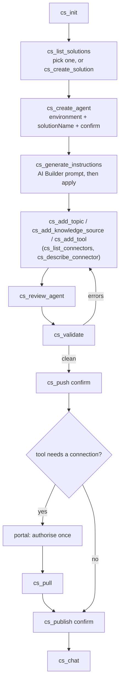
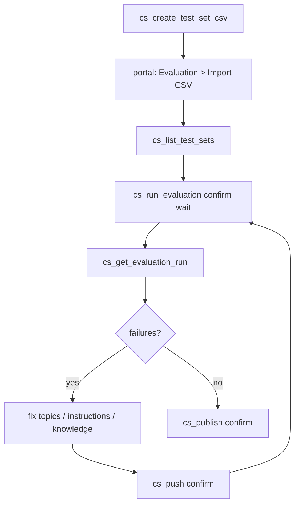
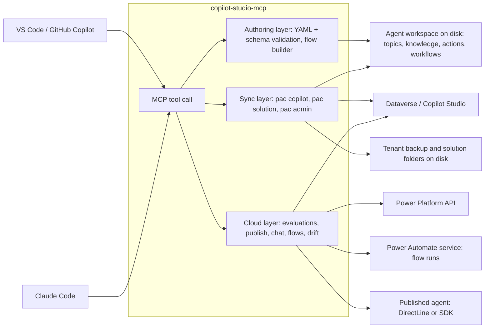

# Copilot Studio MCP

An MCP server that lets a coding agent (GitHub Copilot in VS Code, Claude Code, or any other MCP
client) build, test, ship and look after Microsoft Copilot Studio agents from the editor.

An agent becomes a folder of YAML you can read, diff and commit. The server writes that folder the
way the Copilot Studio VS Code extension does, syncs it with the live agent through the official
Power Platform CLI (`pac`), and calls the Power Platform, Dataverse, BAP, Power Automate and
DirectLine APIs for what the CLI does not cover: evaluations, chat, cloud flows, portal drift,
transcripts. Nothing reaches a live environment without your approval, and when a choice is still
open the tool asks a question instead of failing.

## What you can do with it

| You want to | What happens | Read |
| --- | --- | --- |
| Stand up a new agent and get it live | create it inside a solution, generate instructions, add knowledge, topics and tools, review, validate, push, publish, talk to it | [Build a new agent](#build-a-new-agent) |
| Change an agent that already exists | clone it to files, edit or remove components, review, merge what colleagues changed, push | [Work on an existing agent](#work-on-an-existing-agent) |
| Give the agent something to call | connector actions, MCP servers, cloud flows, AI Builder prompts, other agents, chosen from what the environment actually has | [Give the agent tools](#give-the-agent-tools) |
| Know whether it works | chat with the published agent, repeatable conversation tests, evaluation runs with per-case results | [Publish and test](#publish-and-test) |
| Learn from real users | transcripts, session outcomes, escalation rate, a regression test set built from real questions | [Learn from production conversations](#learn-from-production-conversations) |
| Not overwrite what a colleague did in the portal | see portal changes since your last sync, block a push that would collide, merge | [Keep the workspace and the portal in sync](#keep-the-workspace-and-the-portal-in-sync) |
| Write a Power Automate flow without hand-writing Logic Apps JSON | compose a definition from steps, create the flow, bind its connections, switch it on, read its run history | [Build cloud flows](#build-cloud-flows) |
| Find out why a flow keeps failing | resolve the real error behind a failed connector action, diff the run against one that worked, and see where the failures concentrate | [Build cloud flows](#build-cloud-flows) |
| Move to test and production | pull the whole solution, map connections and variables, deploy 1:1, publish; or use a pipeline | [Ship a solution to another environment](#ship-a-solution-to-another-environment) |
| Prove the stages match | snapshot each environment, compare, gate a pipeline on drift | [Compare environments across DTAP](#compare-environments-across-dtap) |
| Run the tenant | environments, security roles, DLP, tenant settings, backups to files, onboarding a team, the Microsoft 365 agent catalogue | [Administer the tenant](#administer-the-tenant) |

The complete tool list is in [docs/tools.md](https://cdn.jsdelivr.net/npm/copilot-studio-mcp/docs/tools.md) and the diagrams in
[docs/flows.md](https://cdn.jsdelivr.net/npm/copilot-studio-mcp/docs/flows.md); both ship
inside the npm package under `docs/`. The reference sections at the end of this page cover the
[agent settings the server can write](#agent-settings-this-server-can-write),
[authentication and permissions](#authentication-and-app-registration),
[configuration](#configuration), the [hard limits](#what-is-and-is-not-possible) and
[how this differs from pac's own MCP server](#how-this-differs-from-microsofts-own-pac-mcp-server).

## Status

Early release. What has actually been exercised:

- **Offline**: 251 unit tests over the compiled output, plus a pack oracle that round-trips every
  authoring tool's YAML through `pac copilot init` and `pac copilot pack`.
- **Against a real tenant** (2026-09-08, phases A to F of `docs/live-verification.md`): the
  connector registry, the `pac connection list` layout, `pac copilot clone` and its sync metadata,
  drift detection and the `cs_push` conflict refusal, and the evaluation path end to end including
  the portal's CSV import format and the metric status strings. A portal-made agent validates
  clean, so `cs_validate` produces no false positives on real content. That run also caught a real
  bug: `pac copilot publish` prints "Failed to publish" and exits 0, so a failed publish was being
  reported as a success. Fixed.
- **Not yet verified live**: the transcript tools, `cs_check_drift` in quick mode, `cs_chat`, the
  Dataverse `listBots` path, moving a solution between environments, and every flow the flow
  builder produces (none has been imported into an environment yet).

`docs/verify.md` is the short list of what is still open, `docs/STATUS.md` the full record. Read
the dry run before confirming anything that writes.

## Set up

### Prerequisites

- Node.js 20+.
- .NET 10 SDK and the Power Platform CLI: `dotnet tool install --global Microsoft.PowerApps.CLI.Tool`.
  If the SDK lives in your user profile, set `DOTNET_ROOT` to that folder; the server defaults it
  to `~/.dotnet` when that folder exists.
- A pac auth profile for the environment you work in, created once in a terminal:
  `pac auth create --environment <id or URL>`. Everything that goes through pac (create, clone,
  pull, push, publish, solutions, administration) uses it, with Microsoft's own first-party app.
- For the API-based tools (environments, evaluations, chat, flows, drift, transcripts): an Entra
  sign-in through `cs_login`, done from the session. By default no app registration is needed;
  [Authentication and app registration](#authentication-and-app-registration) says when you need
  one and which permissions it must carry.

### Install and register

The server is on npm as `copilot-studio-mcp`, so the usual install is no install: point your MCP
client at `npx`, and the first start fetches the package.

[](https://insiders.vscode.dev/redirect?url=vscode%3Amcp%2Finstall%3F%7B%22name%22%3A%22copilot-studio%22%2C%22command%22%3A%22npx%22%2C%22args%22%3A%5B%22-y%22%2C%22copilot-studio-mcp%22%5D%7D)

There is also a VS Code extension, `vscode-extension/`, which registers the server with VS Code's
MCP host and exposes the environment variables below as settings. It carries the server and its
dependencies inside the VSIX, so it needs no npm and no network on first start. Build it with
`cd vscode-extension && npm install && npm run package`; install the resulting `.vsix` with
`code --install-extension copilot-studio-mcp-<version>.vsix`.

VS Code, from a terminal or by hand in `.vscode/mcp.json` (workspace) or the user-level `mcp.json`:

```sh
code --add-mcp '{"name":"copilot-studio","command":"npx","args":["-y","copilot-studio-mcp"]}'
```

```json
{
  "servers": {
    "copilot-studio": {
      "type": "stdio",
      "command": "npx",
      "args": ["-y", "copilot-studio-mcp"],
      "env": { "CPS_WORKSPACE": "${workspaceFolder}" }
    }
  }
}
```

Claude Code (user scope):

```sh
claude mcp add-json copilot-studio '{"type":"stdio","command":"npx","args":["-y","copilot-studio-mcp"]}' --scope user
```

`npm install -g copilot-studio-mcp` with `"command": "copilot-studio-mcp"` avoids the npx start-up
cost. The server is published to the MCP Registry as `io.github.jgt87/copilot-studio-mcp`, which is
what VS Code's MCP gallery (Extensions view, search `@mcp`) draws from through the GitHub MCP
Registry. To run from a clone instead, see [Development](#development).

Environment variables are optional and listed under [Configuration](#configuration).

### The first session

1. **`cs_init`.** Reports pac and .NET, the pac profiles and which one is active, the MSAL sign-in,
   the write policy in force, the workspace it found and the next steps for it. It also returns a
   menu of tool presets; on a smaller model pick one (see
   [Running on a smaller model](#running-on-a-smaller-model)).
2. **`cs_login`** when a cloud tool needs it. The call opens the browser from the server and returns
   within 15 seconds; if the sign-in has not finished by then it returns `status: pending` with the
   URL so you can open it yourself, and the next cloud call (or `cs_login_status`) picks the token
   up. That is what makes sign-in work from clients that cap tool-call duration or run the server
   where no browser can be launched. Device code (`mode: device_code`) is the alternative where the
   tenant allows it; many block it by Conditional Access policy.
3. **`cs_guide <topic>`** when you want the walkthrough for one job rather than inventing a
   sequence: `getting-started`, `instructions`, `knowledge`, `tools`, `topics`, `evaluations`,
   `publish-and-test`, `drift`, `transcripts`, `solutions`, `administration`, `troubleshooting`.
   Each names the tool per step, the portal steps that cannot be automated, and the next steps for
   your workspace. Six MCP prompts (new agent, add knowledge, add tool, write instructions, review
   and push, check drift) wrap the same walkthroughs in clients that show prompts as commands.

## Approval before anything changes

The server never changes a live Copilot Studio environment on its own. Every tool that can
(`cs_push`, `cs_publish`, `cs_run_evaluation`, `cs_import_solution`, `cs_deploy_solution`,
`cs_create_agent` with an environment, the delete tools, the flow and admin tools that write, and
the environment-changing pac wrappers) returns a **dry run** describing what it would do, and does
nothing else, until it is called again with `confirm: true`. The calling agent is instructed, in the
MCP handshake, to show that dry run and pass `confirm` only after you agree; one approval covers one
call. Writing YAML, editing, reviewing and validating are local file operations and need no
approval; sending them to Copilot Studio does.

For a hard lock, set `CPS_READ_ONLY=1` in the server's environment: the environment-changing tools
are then not registered at all, so no confirmation can reach the environment, while authoring,
validation, review and the read-only tools keep working. `cs_init` reports the mode and which tools
are withheld. `test/policy.test.js` fails if a tool that declares `confirm` is missing from that
list, so the two layers cannot drift apart.

Three more behaviours you will meet in every workflow:

- **A question instead of an error.** When a call cannot proceed because something has not been
  decided (which connector, which operation, which agent), the tool returns `needsInput: true` with
  what it needs, why, the real choices when the server can list them, and the tool that lists more.
  Nothing is written; the calling agent asks you and calls again. This works in every client,
  including those without MCP elicitation.
- **Long calls run in the background.** MCP clients cap a tool call at about a minute. Tools that
  can run longer (`cs_pull_solution`, `cs_create_auth_profile`, environment provisioning, every pac
  wrapper) accept `background: true`, return a `jobId` at once, and `cs_job_status` reports the
  phases and the result from an on-disk record that survives a server restart. A tool decides
  whether it may change anything before it starts a job, so the confirm contract is unaffected.
- **Writes are never retried.** A read that fails on a transport error or a 429/5xx is retried with
  backoff and honours `Retry-After`; a publish or an import that timed out may already have been
  applied, so it is reported, not repeated.

## Two accounts: maker and admin

Making agents and administering the tenant are usually different accounts. pac keeps one active
authentication profile per machine, so create one profile per account and let the server switch:

```sh
pac auth create --name maker --environment <environment id or url>
pac auth create --name admin --environment <environment id or url>
```

Or from the session: `cs_create_auth_profile` with `name`, `environment` and `background: true`,
because pac opens its own browser and waits for the sign-in (`cs_job_status` reports when the
profile exists). `cs_list_auth_profiles` shows the profiles and which is active.

Core sync and solution tools use `CPS_PAC_PROFILE`; admin commands and tenant backup use
`CPS_ADMIN_PROFILE`; every pac wrapper and `cs_pac` also accept an explicit `profile`. When the
server selects a profile it restores the previous one afterwards, and every pac call in the process
shares one queue, so multi-step operations (bootstrap, solution pull and deploy, snapshots) hold
the profile for the whole run. Other server instances and terminal pac commands are outside that
coordination. The MSAL sign-in used by the API-based tools is separate again and independent of pac.

## Build a new agent

From an empty folder to a published agent you can talk to. Each step is one tool call; the steps
that change the environment show a dry run first.

1. **Pick the environment.** `cs_list_environments` (needs `cs_login`), or take the environment id
   from the Copilot Studio URL.
2. **Pick or create the solution.** `cs_list_solutions` shows what exists; an existing solution
   works as long as it is unmanaged and you use its publisher prefix. To start a solution for your
   agents: `cs_create_solution uniqueName=contoso_Agents publisherPrefix=contoso confirm=true`.
3. **Create the agent inside it.**
   `cs_create_agent name="Contoso Support" publisherPrefix=contoso projectDir=./contoso-support
   environment=<id> solutionName=contoso_Agents confirm=true` (add `createSolution=true` to fold
   step 2 in). The server scaffolds locally with `pac copilot init`, packs with the solution name,
   imports, then clones the live agent back so `projectDir` is a sync-connected workspace with the
   default system topics. Without `environment` you get a local scaffold only, which can pack
   settings, agent and topics but not knowledge, tools or flows.
4. **Say what the agent is for.** `cs_generate_instructions purpose="Answer IT questions and create
   ServiceNow tickets" audience="Employees" tone="Friendly, brief" boundaries=["never reset
   passwords"] modelName="Agent instructions"` drafts the instructions with an AI Builder prompt
   (`cs_list_prompts` shows the prompts in the environment; create a "write agent instructions"
   prompt once in AI Builder if you have none). Review the draft, call again with `apply=true` to
   write it into `agent.mcs.yml`; later `refine=true` with a `changeRequest` revises what is
   there. Or write them yourself with `cs_update_agent`, which also sets response instructions and
   mode, conversation history, capabilities, moderation, model and conversation starters (the
   [full map](#agent-settings-this-server-can-write)).
5. **Give it something to work with.** `cs_add_knowledge_source` for a public website, SharePoint,
   a Graph connector or uploaded files; `cs_add_topic` for deterministic conversations built from
   trigger phrases plus message, question, condition, set-variable, redirect, HTTP, flow, generative
   answers (optionally scoped to named knowledge sources), adaptive card, transfer and end nodes;
   `cs_add_tool` for anything the agent should call (the [tools workflow](#give-the-agent-tools)).
   `cs_add_trigger` and `cs_add_variable` cover event triggers and global variables.
6. **Review and validate.** `cs_review_agent` is a rules-based read of the whole workspace with a
   10-point score: missing escalation or fallback, weak tool descriptions, overlapping trigger
   phrases, private knowledge with no authentication, secrets in files. Each finding names the rule
   and the fix. `cs_validate` then checks every file against the authoring schema (744 definitions)
   and across files: connection references that nothing binds, catalog operations that do not
   exist, redirects to topics that are not there.
7. **Push.** `cs_push confirm=true` is the portal's Save: the draft agent now shows your topics,
   knowledge and tools. The dry run runs validation and the quick drift check first, and the push
   is refused when a colleague changed the same component in the portal since your last pull.
   Tools with a connection reference need one portal step: open the tool under the agent's Tools,
   Connect, then `cs_pull` to bring the binding down.
8. **Publish and talk to it.** `cs_publish confirm=true`, then `cs_chat utterance="my laptop is
   slow"`. The [testing workflow](#publish-and-test) turns that into repeatable checks.



GitHub Copilot harness agents (`cs_create_agent` with `authoringMode: cli-copilot`) are a smaller
surface: init, pack, import, instructions and chat. Topics and evaluations are standard-harness
features.

## Work on an existing agent

Most agents already exist, often made in the portal. The loop is clone, change, review, merge, push.

1. **Clone it.** `cs_list_agents` (through pac or Dataverse), then `cs_clone_agent bot=<id or
   schema name> outputDir=./support-agent`. The result is a sync-connected workspace with
   `agent.mcs.yml`, `settings.mcs.yml`, `topics/`, `knowledge/`, `actions/`, `trigger/`,
   `variables/`, `workflows/` and the connection references. `cs_describe_workspace` inventories
   it and ends with next steps.
2. **Change it.** Components are found by name, file stem or path. `cs_edit_topic` changes trigger
   phrases, priority and nodes (by position or id); `cs_edit_tool` changes descriptions, inputs and
   the connection; `cs_edit_knowledge` changes a site or a trigger condition;
   `cs_remove_component` deletes a topic, knowledge source, tool, trigger or variable and prunes
   the connection reference nothing else uses, noting any redirect left dangling. `cs_update_agent`
   and `cs_update_settings` cover the agent's own settings. Adding works as in the new-agent flow.
   Every edit keeps the file header the extension expects.
3. **Review and merge.** `cs_review_agent`, then `cs_pull` to bring down what colleagues changed in
   the portal (pac's three-way merge), then `cs_validate`.
4. **Push.** `cs_push confirm=true`. If a portal change and a local edit touch the same component
   the push is blocked; `cs_pull` resolves it, `force: true` overrides it.
5. **Commit.** Keep the workspace in git and commit after every pull (the tool result reminds you).
   Portal drift then shows up as a diff you can review: accepting it is a commit, rejecting it is a
   push of the local version.

Around that loop: `cs_delete_agent` and `cs_delete_solution` remove things from the environment
(`confirm`); `cs_extract_agent_template` and `cs_create_agent_from_template` turn one agent into a
template for more; `cs_extract_translations` and `cs_merge_translations` do the localisation round
trip (.resx or .json, with `whatIf`); `cs_quarantine_agent` takes an agent out of service and back.

## Give the agent tools

Copilot Studio agents can call any connector in the environment (more than a thousand
Microsoft-published ones plus custom connectors), MCP servers exposed through connectors, cloud
flows, AI Builder prompts, other agents, and a few rarer kinds. The server knows the **kinds** from
the YAML schema and the **instances** from the environment, which is the only source that knows
what exists there.

1. **Find the connector.** `cs_list_connectors search=ServiceNow` lists the environment's connector
   registry, the same list the portal's Add a tool shows, with MCP servers flagged. Without a
   sign-in it falls back to an offline seed generated from the public connector reference (display
   name to `shared_` id, no operations): a starting point, not proof the connector is enabled for
   you.
2. **Find the operation.** `cs_describe_connector connector=shared_service-now operation=incident`
   turns the connector's OpenAPI definition into operations with `operationId`, required and
   optional parameters and response fields; `x-ms-agentic-protocol: mcp-streamable-1.0` marks MCP
   endpoints. Definitions are cached under `.cs-catalog/<environment>/` so later calls are offline.
3. **Add the tool.** `cs_add_tool` takes a typed spec for a connector action, an MCP server, a cloud
   flow, an AI Builder prompt (`cs_list_prompts` shows them), a connected agent or a child agent,
   and a `raw` type for the rest (AI plugin, Bot Framework skill, client action, computer-use
   agent). With the definition cached it checks the `operationId`, fills the automatic inputs from
   the operation's required parameters, and writes the YAML under `actions/` plus a
   connection-reference stub. If you have not named a connector or operation yet the call comes
   back as a question with the ranked candidates.
4. **Connect it, once, in the portal.** A connection is an authorised link that only the portal can
   create (the one exception is a service-principal Dataverse connection, which
   `cs_create_connection` makes). After `cs_push`, open the tool under the agent's Tools, Connect,
   then `cs_pull`. `cs_validate` warns about tool files whose operation is not in the cached
   definition, and `cs_review_agent` flags tools whose description will not let the orchestrator
   pick them.

A unit test compares the schema's list of tool kinds with the server's table, so a schema update
that introduces a new kind fails the build until the kind is classified. Flows as tools are either
a scaffold (`cs_add_flow`, experimental) or a real flow built with the
[flow builder](#build-cloud-flows) and referenced from the agent.

## Publish and test

1. **Publish.** `cs_publish confirm=true` is the Publish button, through `pac copilot publish` or
   the Dataverse `PvaPublish` action polled until `publishedon` moves.
2. **Chat.** `cs_chat utterance="..."` sends one utterance to the published agent and returns the
   reply; pass the `conversationId` back for the next turn. With `transport: auto` the server reads
   the agent's authentication mode: no-auth and manual-auth agents go through DirectLine (the token
   endpoint of a published agent is anonymous, so no app is needed); an agent with integrated Entra
   authentication goes through the Copilot Studio client SDK and needs your own app id with the
   `CopilotStudio.Copilots.Invoke` scope (`clientId`, or `CPS_CLIENT_ID`).
3. **Make it repeatable.** `cs_run_conversation_tests` runs a YAML file of utterances and
   expectations through the same chat path and reports what failed. Expectations cover the
   wording and what the agent did: `usedTool`, `notUsedTool`, `usedTopic`, `notUsedTopic` and
   `citedKnowledge` read the topic, tool and knowledge attribution from the activities, so a test
   can tell a real tool call from an answer that merely reads correctly. Every result, and every
   `cs_chat` reply, reports the observed topic, tool and citations; an expectation that cannot be
   judged (no attribution in the activities) says so rather than failing the agent. The
   attribution key names come from documentation and are unverified live;
   `docs/test-verification.md` is the runbook that settles them.
4. **Evaluate.** The portal's Evaluation feature runs a test set of questions against the agent and
   scores each answer. The one thing its API cannot do is create the test set, so the loop is:

   - `cs_create_test_set_csv suggestFromWorkspace=true` writes the CSV in the portal's import
     format (max 100 cases), seeded from your topics and knowledge.
   - Import it once in the portal's Evaluation tab.
   - `cs_list_test_sets`, then `cs_run_evaluation confirm=true wait=true`, then
     `cs_get_evaluation_run` for per-case results with pass and fail buckets;
     `cs_list_evaluation_runs` for the history.



## Learn from production conversations

Once people use the agent, the transcripts are the best source of test cases and of the questions
it cannot answer. Copilot Studio stores every session in the Dataverse `conversationtranscript`
table; the server reads it and never writes.

- `cs_list_transcripts` lists sessions in a window: when, how many turns, the first question, the
  topics and tools that fired, how it ended.
- `cs_get_transcript` returns one session's full turn list with the topic and tool attributed to
  each turn.
- `cs_summarize_transcripts` aggregates a window: outcomes, escalation rate, sessions that matched
  no topic, the top topics and tools, and the questions behind the failures.
- `cs_test_set_from_transcripts` builds the Evaluation import CSV from questions people actually
  asked, failures first, so the next evaluation run covers what went wrong.

Copilot Studio does not report whether a conversation succeeded. The outcome is this server's
reading of the transcript (an escalation, the agent saying it could not answer, a user turn with no
reply); `resolved` means nothing marked the session as failed, not that the user was satisfied.
Every result repeats that caveat, and `cs_guide transcripts` walks the loop from a summary to one
transcript to a regression test set. Transcripts hold what users said to the agent, so the
signed-in user needs a role that grants read on that table and results are customer data.
**Unverified against a live tenant.**

## Keep the workspace and the portal in sync

Makers can keep editing an agent in Copilot Studio after it was cloned; nothing stops them and the
platform sends no notification. Every portal edit lands in Dataverse rows: the `bot` row for
settings and instructions, and one `botcomponent` row per topic, knowledge source, tool, trigger
and variable, each with a modified-on stamp and the user who changed it. The server uses those rows
to see drift without a re-scan, and a clone to confirm it when the details matter.

1. **Sync stamp.** `cs_clone_agent`, `cs_pull`, `cs_push` and `cs_create_agent` (with
   `environment`) write `.mcs/cs-sync.json`: a fingerprint of every workspace file and, when a
   Dataverse sign-in is cached, the modified-on stamp of every component. `cs_describe_workspace`
   shows the last sync.
2. **Quick check.** `cs_check_drift` (default `mode: quick`) reads the bot row and its component
   rows and compares them with the stamp: which components were modified, added or removed in the
   portal, by whom and when, whether the agent settings changed, and whether the live agent has
   unpublished changes. Each component is mapped to its workspace file; when that file also changed
   locally the entry is a conflict. Seconds, no pac; needs `cs_login`.
3. **Full check.** `cs_check_drift mode=full` runs `pac copilot clone` into a temporary folder and
   classifies every file three ways against the stamp: `local-modified`, `remote-modified`,
   `both-modified` (conflict), added or deleted on either side, with unified diffs. Use it when the
   quick check reports drift and you want the exact content, or when there is no Dataverse sign-in
   (only the pac profile is needed). Uploaded knowledge files are covered here, not in the quick
   check.
4. **Push preflight.** The `cs_push` dry run includes the quick check, so the caller sees "three
   components changed in Copilot Studio since your last pull" before confirming. With `confirm`,
   the push is blocked when a portal change and a local edit touch the same component; `cs_pull`
   (pac's three-way merge) resolves it and `force: true` overrides it.
5. **Git as the ledger.** Commit after every `cs_pull`; `cs_check_drift` reports whether the
   workspace is in a repository and how many of its files are uncommitted.

Limits. The quick check does not see connections (a maker connecting a tool is expected, and
connection ids are ignored in every comparison), uploaded knowledge files, channel configuration or
the security group. When the stamp has no per-component baseline (no Dataverse sign-in at sync
time) it falls back to the sync time with a two-minute margin, so edits made right after a sync
count as the sync itself. The component query has not been verified against a live environment
yet; see `docs/STATUS.md`.

## Build cloud flows

Flows are built from a step spec, the way topics are, so you do not have to write Logic Apps JSON
by hand. `cs_build_flow_definition` composes the definition locally and returns it together with
the connection references it needs; `cs_create_flow` takes the same spec and creates the flow in an
environment or a solution; `cs_update_flow` takes it and replaces the definition of an existing
unmanaged flow, keeping its connection references.

A spec is a trigger plus steps that run in order:

| Trigger | For |
| --- | --- |
| `agent` (default) | the flow a Copilot Studio agent calls as a tool, with typed inputs and a response |
| `manual`, `http` | started by a person or by an HTTP request |
| `recurrence` | a schedule |
| `connector` | a connector event, such as a Dataverse row being created |
| `raw` | any other trigger, written verbatim |

| Step | Emits |
| --- | --- |
| `connector` | a connector operation (`OpenApiConnection`), with its parameters and connection reference |
| `http` | an HTTP call |
| `condition`, `foreach`, `scope` | branching, looping and grouping, with their own nested steps |
| `initializeVariable`, `setVariable`, `compose` | variables and intermediate values |
| `terminate` | end the run with a status |
| `response` | what an agent-callable or HTTP flow answers with (added automatically when you give `outputs`) |
| `raw` | any other action, written verbatim |

The builder chains `runAfter` so each step waits for the previous one, normalises action names the
way Power Automate does, and collects one connection reference per connector used, reusing it
across steps. Expressions are Logic Apps expressions, not Power Fx: `@{triggerBody()?['orderId']}`,
`@body('List_rows')?['value']`. Connector ids and operation ids come from `cs_list_connectors` and
`cs_describe_connector`; an operation's parameters are exactly the `parameters` of a connector
step.

Around the builder: `cs_list_flows` shows the flows in the environment with state, owner and
connection references; `cs_get_flow` returns one with its full definition; `cs_delete_flow` removes
one for good; `cs_list_flow_runs`, `cs_get_flow_run` and `cs_run_flow` read the run history and
start a manual run through the Power Automate service (a separate sign-in, `cs_login scope='flow'`;
the signed-in user must own or co-own the flow).

**Bind the connections.** A connection reference names a connector; a connection is one person's
authorised account for it, and until the two are joined the flow cannot run. `cs_bind_flow_connection`
joins them: with one reference and one usable connection it needs nothing but the flow id, and it
asks which when there is a choice. It writes whichever of the two shapes the flow uses - a flow
built outside a solution names its connection directly, while one that arrived in a solution points
at a `connectionreference` row - and `activate: true` turns the flow on in the same call.
`cs_set_flow_state` turns one on by itself once it is bound.

**Work out why a run failed.** The run list says a run failed and nothing more.

| Tool | Answers |
| --- | --- |
| `cs_explain_flow_run` | *Why did this run fail?* A failed connector action carries no error message of its own - the message is in the action's outputs, behind a link that expires after a few days - so this fetches it, says whether the fault is the connector, an expression or a timeout, and shows the inputs the action was called with next to the outputs of the actions that ran just before it. |
| `cs_compare_flow_runs` | *It worked yesterday.* Diffs the failed run against the most recent successful one and names the action where they part company. With `compareTriggerData: true` it reports which keys of the trigger payload differ (key names only, never the values), which is what separates a bad input from a broken flow. Actions present in one run but not the other mean the definition itself changed. |
| `cs_analyze_flow_health` | *It fails sometimes.* Failure rate, duration median and 90th percentile, and which actions the failures land on. One action responsible for most of them is a broken step; failures spread across many point at the connection, throttling or the system being called. |

A trigger that failed means the flow never ran at all, so the fault is in the trigger's connection
or its parameters rather than the logic. Run detail ages out: inputs and outputs are kept for a
limited time, so diagnose a failure while it is recent.

Two things the builder cannot do for you. The connections themselves must exist in the target
environment before anything can be bound to them, which is why a new flow is created switched off.
And the definitions follow the Logic Apps schema and exported solutions rather than a verified
round trip, so import one and open it in Power Automate before trusting the shape.

## Ship a solution to another environment

Per-agent sync stays bound to the environment the agent came from. Moving to test or production
is a solution export and import, and the server makes that a pull, a settings file and a deploy.

1. **See what you are moving.** `cs_list_solutions`, then `cs_describe_solution` exports, unpacks
   and inventories: agents, bot components, flows, connection references, environment variables,
   custom connectors.
2. **Pull it.** `cs_pull_solution` exports the solution unmanaged and managed, unpacks it to
   `src/`, writes `solution.json` (the manifest the deploy reads), creates
   `deployment-settings.json` and clones every agent into `agents/`. A full pull runs for minutes,
   so pass `background: true` and follow it with `cs_job_status`; the outcome also lands in
   `pull-job.json` in the target directory.
3. **Map the target.** `cs_list_connections` on the target environment shows the connections that
   exist there; `cs_create_deployment_settings` maps each connection reference to one of them, sets
   the environment variable values for the target and, per agent, the Entra security group that may
   use it.
4. **Deploy.** `cs_deploy_solution confirm=true` imports into the target with the settings file and
   runs `pac copilot publish` on every agent (`publishAgents`, default on). It refuses to import
   while any connection reference is unmapped unless you pass `allowUnmapped: true`. If you edited
   `src/` by hand, `cs_pack_solution` first.

Quality gates and alternatives on the same path: `cs_check_solution` runs Solution Checker before a
deploy; `cs_set_solution_version`, `cs_solution_online_version` and `cs_upgrade_solution` handle
release numbering and staged upgrades; `cs_publish_customizations` publishes everything in an
environment; `cs_list_pipelines` and `cs_deploy_pipeline` use Power Platform pipelines instead of
a direct import; `cs_init_solution_project`, `cs_clone_solution`, `cs_sync_solution`,
`cs_add_solution_reference` and `cs_add_solution_license` keep a source-controlled solution
project (.cdsproj); `cs_add_solution_component` adds an existing component to a solution.

### What no tooling carries across

Plan for these before calling the copy "1:1":

- **Connections are not part of a solution.** A solution carries connection *references*; the
  connections themselves (the authorised links to SharePoint, Outlook, Dataverse, MCP servers, ...)
  must already exist in the target environment, created and consented by a user there.
  `cs_create_connection` is the one exception and only covers service-principal Dataverse
  connections. With `allowUnmapped: true` the tools stay unbound until someone binds them in the
  target portal.
- **Cloud flows land switched off** when their connection references cannot be resolved. Bind the
  connections, then `cs_list_flows` shows which are not activated and `cs_set_flow_state` switches
  each on; the portal is not needed for that step.
- **Environment variables need target values.** The settings file lists every variable; leave a
  value empty and the target inherits the default from the solution, which is usually a dev value.
- **Who can use the agent is per environment.** The settings file has a `CopilotAgents` section
  with an `AadGroupId` per agent (verified with pac 2.11.2). Map it to the target's Entra group
  (`copilotAgents` in `cs_create_deployment_settings`) or set access in the target portal after
  import; an all-zero id means no group is set.
- **Some agent content lives outside the solution.** Uploaded knowledge files, Dataverse tables used
  as knowledge, SharePoint permissions, and channel configuration (Teams, web, Microsoft 365
  Copilot) are environment-specific. After import, check knowledge sources and re-publish to
  channels in the target portal.
- **Managed vs unmanaged.** `cs_pull_solution` exports both. Deploy managed for downstream
  environments and keep unmanaged only for development; a managed import cannot be edited in place
  in the target.
- **Per-agent sync does not cross environments.** Workspaces from `cs_clone_agent` or
  `cs_pull_solution` push back to their source environment only. Edit the `agents/<name>`
  workspace, push to the source, then pull and deploy the solution again.

## Compare environments across DTAP

When the same solution is promoted through development, test, acceptance and production, the
question is whether each stage still holds what the previous one holds. The platform has no
cross-environment diff, but every input is reachable, so the server captures each environment into
a **snapshot folder** and compares snapshots offline.

1. **Snapshot each stage** with `cs_snapshot_environment` (or all at once with
   `cs_compare_environments`, which takes an ordered chain and compares each adjacent pair). A
   snapshot folder contains:

   ```
   snapshots/TEST/
     snapshot.json         label, environment, time, solution version and managed flag,
                           agents with publish state, flows, connection references,
                           environment variables, notes
     agents/<Agent name>/  the agent as YAML, from pac copilot clone
   ```

   Agents are cloned rather than exported as a solution, because a managed solution cannot be
   exported from test or production. Flows, connection references, environment variables and
   publish state come from Dataverse and are included when you are signed in with `cs_login`;
   otherwise the snapshot notes that they were skipped.
2. **Compare adjacent stages** with `cs_compare_snapshots` (DEV vs TEST, TEST vs ACC, ACC vs PROD).
   Each comparison writes `<A>-vs-<B>.md` and `.json`.
3. **Read the verdict.** A report starts with `DRIFT` or `no drift`, then lists the drift, the
   expected differences, and tables per layer with unified diffs for changed agent files.
4. **Act on it.** Drift in agent YAML means the later stage is behind or was edited in place:
   promote again with the solution flow above. Unbound connection references, missing flows, or
   variables without a value are deployment-settings problems: fix the settings file and redeploy.
5. **Keep history.** Snapshot folders are plain files; commit them (without `.mcs/` state) to get
   a timeline per stage.

What counts as drift, and what is an expected difference between stages:

| Layer | Drift | Expected difference (reported, not drift) |
| --- | --- | --- |
| Solution | version differs, missing in a stage | managed in later stages, unmanaged in development |
| Agent YAML (topics, instructions, knowledge, tools, triggers, variables) | any changed, added or removed file after normalisation | ids, audit info, version fields, connection ids inside `connectionreferences.mcs.yml` (removed before diffing) |
| Publish state | modified after last publish in any stage (unpublished changes) | |
| Flows | missing in a stage, on/off state differs | |
| Connection references | missing, connector differs, unbound in a stage | bound to a different connection per stage |
| Environment variables | missing, no value in a stage | different values per stage (drift only with `strictVariables`) |
| Authentication mode | differs between stages | |

**Pipeline gate.** `cs_compare_snapshots` and `cs_compare_environments` accept `failOnDrift`; the
tool result is then an error, which a scripted MCP client or a pipeline step can turn into a failed
job. A typical gate before promoting TEST to ACC:

```
cs_snapshot_environment label=TEST environment=<test id> dir=snapshots/TEST solution=<name>
cs_snapshot_environment label=ACC  environment=<acc id>  dir=snapshots/ACC  solution=<name>
cs_compare_snapshots a=snapshots/TEST b=snapshots/ACC failOnDrift=true
```

Caveats: all stages must be reachable from the active pac auth profile (for chains that span
tenants, run `pac auth select` between stages and snapshot them one by one); whether
`pac copilot clone` succeeds on a managed agent is unverified live (the fallback is reading the same
component definitions through the Dataverse Web API); uploaded knowledge files and channel
configuration are listed by name and size only; without a Dataverse sign-in the comparison covers
solution version and agent YAML only, and the report says so.

## Administer the tenant

Administration runs as the admin account ([two accounts](#two-accounts-maker-and-admin)): pass
`profile`, or set `CPS_ADMIN_PROFILE` once. Every change goes through the same dry run and
`confirm`; reset, delete, copy and restore destroy or overwrite whole environments, and the dry run
says what will be lost.

- **Back the configuration up to files.** `cs_backup_tenant` writes the whole tenant configuration
  to a folder: tenant settings, environments, DLP policies, environment groups, service principals,
  registered applications, templates, and per environment its details, solutions, agents,
  connections, security roles and platform backups. Raw output is kept next to parsed rows, and a
  capture that fails is isolated so the rest of the backup still lands.
- **Read and change the tenant.** Environments and their operations in progress, tenant settings
  (read to a JSON file, change one), DLP policies (which connectors may be combined), environment
  groups, security roles, service principals and registered applications, managed-environment
  governance, administration mode and backup retention, and the environment lifecycle: create,
  copy, back up, restore, reset, delete. Each is one `cs_admin_*` tool
  ([list](https://cdn.jsdelivr.net/npm/copilot-studio-mcp/docs/tools.md#tenant-administration-power-platform-admin-centre-run-as-the-admin-profile)).
- **Onboard a team into a new environment.** `cs_admin_create_environment` (slow; pair it with
  `background: true` and `cs_job_status`), then `cs_admin_assign_users` with a CSV:

  ```csv
  UPN,Security Roles,Business Unit
  alice@contoso.com,"System Customizer,Basic User",Sales
  bob@contoso.com,Environment Maker,
  ```

  pac takes one user and one role per call, so that roster is five calls; the tool expands it,
  shows you every user-and-role pair in the dry run, and runs them under one approval. Rows are
  independent, so a mistyped UPN is reported and the rest still run. Prefer
  `cs_admin_assign_group` when the roster is really a group: binding an Entra group to a role is
  one call however many people are in it, and new joiners inherit access. Role names are
  per-environment (`cs_admin_list_security_roles` against the new one), and a user who has not
  been provisioned into the environment yet cannot hold a role there.
- **The Microsoft 365 agent catalogue.** `cs_list_agents` reads one environment's `bots` table and
  stops at the Power Platform boundary. The catalogue (Microsoft Graph, a separate sign-in with
  `cs_login scope='graph'`) is tenant-wide and answers the question that follows `cs_publish`: did
  the agent actually reach anyone? `cs_list_org_agents` reports who each agent is available to,
  where it is deployed and whether it is blocked, filtered by platform, host, element type or
  last-modified date; `cs_get_org_agent` returns one entry in full; `cs_block_org_agent` blocks an
  agent for everyone in the tenant or lifts the block, and `cs_reassign_org_agent` hands it to a
  new owner when the old one leaves (both `confirm`). Needs a Microsoft Agent 365 licence, is
  global-cloud only, is unverified against a live tenant, and block and reassign exist only on
  Graph `beta`.

Every pac command without a tool of its own is reachable through `cs_pac`: read-only commands run
immediately, the others return a dry run and need `confirm`. The pac groups outside Copilot Studio
work (application, canvas, catalog, code, data, managed-identity, model, modelbuilder, package,
pages, pcf, plugin, power-fx, telemetry, test, tool) are deliberately left there.

## Agent settings this server can write

An agent's settings live in two files, and the server reads, validates and pushes both. The table
maps what the portal shows to the field and the tool argument that writes it. Everything here is a
local file change; `cs_push` applies it, and `cs_publish` makes it live.

**`agent.mcs.yml`** (the agent definition), written by `cs_update_agent`:

| Portal | Field | Argument |
| --- | --- | --- |
| Instructions | `instructions` | `instructions`, `appendInstructions` (or `cs_generate_instructions`) |
| Responses: how answers are worded and formatted | `responseInstructions` | `responseInstructions`, `appendResponseInstructions` |
| Responses: response mode | `defaultResponseMode` | `defaultResponseMode`: `Auto`, `ThinkDeeper`, `QuickResponse` |
| Conversation history the agent sees | `historyType` | `history`: `none` or `conversation`, with `historyMessages` |
| Capabilities: web browsing, code interpreter, image generation, Teams / SharePoint / email / meeting / people search | `gptCapabilities` | `capabilities` (only the toggles you pass change) |
| General knowledge: may the model answer beyond your knowledge sources | `aISettings.useModelKnowledge` | `useModelKnowledge` |
| Content moderation | `aISettings.contentModeration` | `contentModeration`: `Minimum` to `Maximum` |
| File analysis, semantic search | `aISettings.isFileAnalysisEnabled`, `aISettings.isSemanticSearchEnabled` | `isFileAnalysisEnabled`, `isSemanticSearchEnabled` |
| Model | `aISettings.model.modelNameHint` | `modelNameHint` |
| Conversation starters | `conversationStarters` | `conversationStarters`, `addConversationStarters` |
| Display name | `displayName` | `displayName` |

Values are checked against the authoring schema, so a response mode or moderation level outside the
allowed set is refused rather than written.

**`settings.mcs.yml`** (how the agent runs), written by `cs_update_settings` with dot paths, for
example `{"configuration.settings.GenerativeActionsEnabled": true}`:

| Portal | Path |
| --- | --- |
| Generative orchestration on or off | `configuration.settings.GenerativeActionsEnabled` |
| Authentication | `authenticationMode` (`None`, `Integrated`, `Manual`), `authenticationTrigger`, `accessControlPolicy` |
| Language | `language` |
| Agent can be called by other agents | `configuration.isAgentConnectable` |
| Analytics, telephony, voice, network | `configuration.analyticsSettings`, `isTelephonyEnabled`, `botSpeechSettings`, `networkSettings` |

`cs_update_settings` refuses to change `authoringModel`, `recognizer.kind` and `template`,
because the tooling depends on them. `cs_lookup_schema` shows any other field the schema allows,
and `cs_validate` checks whatever you write by hand.

One caveat: these field names come from the authoring schema, not from a round trip through a live
agent, so which portal control maps to which field is inference. Set one in the portal, run
`cs_clone_agent` and compare if you need certainty.

## Authentication and app registration

The server signs users in with an MSAL **public client** (interactive browser or device code). It
never uses client secrets, so every permission it needs is a **delegated** permission acting as the
signed-in user. Application permissions are listed below only where Microsoft offers them, for
people who build a headless pipeline on top of the same APIs. How `cs_login` behaves inside an MCP
client is described under [The first session](#the-first-session).

Do you need your own app registration?

| Situation | App registration needed? |
| --- | --- |
| `pac` commands (`cs_create_agent`, `cs_clone_agent`, `cs_pull`, `cs_push`, `cs_pack`, `cs_publish` via pac, `cs_check_drift` in `full` mode, all `cs_*_solution` tools, and every pac wrapper) | No. `pac auth create` signs in with Microsoft's own first-party app. |
| Cloud tools with the default client id (`cs_list_environments`, `cs_list_agents` via Dataverse, `cs_publish` via Dataverse, `cs_check_drift`, evaluations, `cs_chat` for no-auth or manual-auth agents) | No. The server uses the first-party VS Code client id `51f81489-12ee-4a9e-aaae-a2591f45987d`, which is pre-authorised for Power Platform API, Dataverse and the Power Apps service. Microsoft's own Copilot Studio tooling uses the same id. |
| Same tools, but your tenant blocks that id (app consent policy, conditional access, "user assignment required") | Yes. Create the registration below and set `CPS_CLIENT_ID`. |
| `cs_chat` with an agent that uses **integrated authentication (Entra SSO)** | Yes, always. The first-party id does not carry `CopilotStudio.Copilots.Invoke` for third parties. Pass `clientId` to `cs_chat` or set `CPS_CLIENT_ID`. |
| Headless CI (service principal, no user) | Not supported by this server today (public client only). For pipelines use `pac auth create --applicationId ... --clientSecret ...` with a Dataverse application user, or the Power Platform API with an RBAC role assigned to the service principal. |

Permissions for your own app registration (Entra ID > App registrations > API permissions > "APIs my organization uses"):

| Used by | API to pick in Entra | Permission | Delegated or application | Notes |
| --- | --- | --- | --- | --- |
| `cs_chat` (transport `sdk`, Entra-SSO agents) | **Power Platform API** (app id `8578e004-a5c6-46e7-913e-12f58912df43`) | `CopilotStudio.Copilots.Invoke` | Delegated is what this server uses. An application permission of the same name exists for confidential clients (Microsoft 365 Agents SDK); not used here. | Admin consent is normally required. Redirect URI `http://localhost` (Mobile and desktop applications). |
| `cs_list_test_sets`, `cs_run_evaluation`, `cs_get_evaluation_run`, `cs_list_evaluation_runs` | **Power Platform API** | Token scope `https://api.powerplatform.com/.default`. The evaluation endpoints declare only `.default`; the permission reference has no finer-grained evaluation permission. | Delegated only. Power Platform API has no application permissions; service principals get access through RBAC roles instead. | Verified with the first-party id by Microsoft's own tooling. Not yet verified with a custom registration; if calls return 403, the signed-in user needs maker access to the agent. |
| `cs_list_environments`, automatic Dataverse URL lookup, `cs_list_connectors`, `cs_describe_connector`, the connection lookup in `cs_bind_flow_connection` | **PowerApps Service** (app id `475226c6-020e-4fb2-8a90-7a972cbfc1d4`) | `User` ("Access the Power Apps Service API") | Delegated. | Calls the BAP environments API (`api.bap.microsoft.com`), the connector registry and the connections list (`api.powerapps.com`). Listing connections shows every one in the environment the signed-in user can see, including other people's; binding one makes the flow run as that connection's owner. |
| `cs_list_agents` (via `dataverse`), `cs_publish` (via `dataverse`), authentication-mode detection in `cs_chat`, `cs_check_drift` (quick mode), the drift preflight in `cs_push`, the component stamps recorded by `cs_clone_agent` / `cs_pull` / `cs_push`, the flow tools (`cs_list_flows`, `cs_get_flow`, `cs_create_flow`, `cs_update_flow`, `cs_set_flow_state`, `cs_delete_flow`, and the Dataverse half of `cs_bind_flow_connection`) and the transcript tools (`cs_list_transcripts`, `cs_get_transcript`, `cs_summarize_transcripts`, `cs_test_set_from_transcripts`) | **Dynamics CRM** (Dataverse, app id `00000007-0000-0000-c000-000000000000`) | `user_impersonation` | Delegated. There is no application permission; server-to-server access to Dataverse means an **application user** with a security role in each environment. | The user still needs a Dataverse security role that can read and publish bots (System Customizer or a Copilot Studio maker role). The drift checks only read the `bot` and `botcomponent` tables, which every maker role can read; they never write to Dataverse. The transcript tools read `conversationtranscript`, which holds **what users actually said to the agent**: a more sensitive table than the rest, so the signed-in user needs a role that grants read on it, and results should be treated as customer data. When a workspace has no Dataverse URL in its sync metadata the URL is looked up through the PowerApps Service permission above. |
| `cs_list_flow_runs`, `cs_get_flow_run`, `cs_run_flow`, `cs_explain_flow_run`, `cs_compare_flow_runs`, `cs_analyze_flow_health` | **Microsoft Flow** (Power Automate service, app id `7df0a125-d3be-4c96-aa54-591f83ff541c`) | `User` (token scope `https://service.flow.microsoft.com/.default`, override with `CPS_FLOW_SCOPE`) | Delegated. | A separate resource from Dataverse and the Power Platform API, so it needs its own consent: sign in with `cs_login scope='flow'`. The signed-in user must be an owner or co-owner of the flow. Endpoints and scope are taken from the service the Power Automate portal calls and are unverified against a tenant. The diagnostic tools also follow the SAS-signed content links the service returns for an action's inputs and outputs; those are fetched **without** the bearer token, because they carry their own signature, and they expire after a few days. |
| `cs_list_org_agents`, `cs_get_org_agent` | **Microsoft Graph** (app id `00000003-0000-0000-c000-000000000000`) | `CopilotPackages.Read.All` (override the scope with `CPS_GRAPH_SCOPE`) | Delegated is what this server uses; an application permission of the same name exists for reads. | The Microsoft 365 agent catalogue, a different resource again: sign in with `cs_login scope='graph'`. **Requires a Microsoft Agent 365 licence** and is global-cloud only (no GCC, DoD or 21Vianet). Reads `/v1.0/copilot/admin/catalog/packages`. Unverified against a live tenant. |
| `cs_block_org_agent`, `cs_reassign_org_agent` | **Microsoft Graph** | `CopilotPackages.ReadWrite.All` (override with `CPS_GRAPH_WRITE_SCOPE`) | Delegated only. Microsoft offers **no application permission** for these two actions. | Same licence and cloud limits as above; sign in with `cs_login scope='graph_write'`. These exist only on `/beta`, so they are pinned there whatever version a read used. Blocking is tenant-wide and takes effect for every user at once. Unverified against a live tenant. |
| `cs_chat` for no-auth or manual-auth agents (DirectLine) | none | none | not applicable | The DirectLine token endpoint of a published agent is anonymous. |
| `pac` interactive sign-in | none | none | not applicable | Microsoft's own app; `pac auth create --environment <id>`. |

Steps for your own registration:

1. Entra ID > App registrations > New registration. Single tenant. Under **Authentication** add the
   platform **Mobile and desktop applications** with redirect URI `http://localhost` (the loopback
   MSAL uses for `cs_login` interactive). Set **Allow public client flows** to Yes if you plan to use
   `cs_login` with `mode: device_code`.
2. Add the permissions from the table. If **Power Platform API** does not appear when you search
   by name or by the id above, its service principal is missing from your tenant; create it with
   `az ad sp create --id 8578e004-a5c6-46e7-913e-12f58912df43` (or
   `New-MgServicePrincipal -AppId 8578e004-a5c6-46e7-913e-12f58912df43`) and search again.
3. **Grant admin consent** for the tenant, or let each user consent interactively on first sign-in.
4. Put the ids in the MCP server environment: `CPS_CLIENT_ID=<application (client) id>` and
   `CPS_TENANT_ID=<directory (tenant) id>`. `cs_chat` also accepts `clientId` per call.

## Configuration

All environment variables are optional:

| Variable | What it does |
| --- | --- |
| `CPS_WORKSPACE` | the agent workspace to start in (VS Code: `${workspaceFolder}`); otherwise the server looks for marker files in the current directory, a single child, or an ancestor |
| `CPS_TENANT_ID`, `CPS_CLIENT_ID` | the Entra tenant and app registration for `cs_login`; default tenant `organizations`, default client the first-party VS Code id |
| `CPS_ENVIRONMENT_ID`, `CPS_ENVIRONMENT_URL`, `CPS_AGENT_ID` | defaults for cloud tools when the workspace carries no sync metadata; explicit arguments win, then workspace metadata, then these, then a BAP lookup |
| `CPS_PAC_PROFILE`, `CPS_ADMIN_PROFILE` | the pac auth profile for maker commands and for admin commands ([two accounts](#two-accounts-maker-and-admin)) |
| `CPS_READ_ONLY` | withhold every environment-changing tool ([approval](#approval-before-anything-changes)) |
| `CPS_TOOLS`, `CPS_TOOLS_EXCLUDE` | trim the tool list: presets and comma-separated names with `*` wildcards (below) |
| `CPS_FLOW_SCOPE`, `CPS_GRAPH_SCOPE`, `CPS_GRAPH_WRITE_SCOPE` | override the token scopes for the Power Automate service and Microsoft Graph |
| `CPS_CACHE_DIR`, `PAC_PATH`, `DOTNET_ROOT` | token cache location, the pac executable, the .NET root |

### Running on a smaller model

The full tool list is 142 tools, about **50k tokens of schema** before any work starts. A frontier
model copes; a smaller one spends most of its context on the menu and chooses worse from it. Set
`CPS_TOOLS` to a preset in the server's environment, or let the user choose during the session:
`cs_init` returns a `toolPresets` block with the question, the option table and a live count per
preset, and `cs_set_tool_preset` applies the answer.

| Preset | Tools | When to use it |
| --- | --- | --- |
| `full` (the default) | 142 | everything; a large model, or you do not know yet what the task needs |
| `core` | 34 | build or change one agent and get it live: the usual choice |
| `authoring` | 25 | write and check files only; no sign-in, nothing reaches an environment |
| `admin` | 44 | tenant administration as the admin account, plus `cs_backup_tenant` |
| `solutions` | 25 | pull, deploy and compare solutions, and bind the flows an import left switched off |

Nothing is removed: a preset only changes which tools are *offered*, and `cs_init`, `cs_guide`,
`cs_set_tool_preset` and `cs_job_status` survive every preset so a session can always change its
mind. `cs_pac` is in `core`, `admin` and `solutions` so any pac command a preset hides is still
reachable, and `cs_init` says that a missing tool is hidden rather than absent. Presets compose
with each other and with globs: `CPS_TOOLS=core,cs_admin_*`, or
`CPS_TOOLS_EXCLUDE=cs_*_pipeline,cs_env_*,cs_*_auth_profile`. The SDK sends
`notifications/tools/list_changed` on a switch, so a client that honours it sees the shorter list
at once; one that caches the list needs a restart. Runtime switching can only narrow what was
registered at startup, so leave `CPS_TOOLS` unset if you want every preset available to choose
from.

### Checking that your model picks the right tool

A tool list this long is a routing problem: the descriptions decide whether "why did my flow fail
last night?" reaches `cs_explain_flow_run` or something that answers a different question. The
package ships the check, so you can measure it against your own preset, your own model and your
own phrasings rather than trusting the numbers here:

```sh
npx copilot-studio-mcp-routing-eval --dry-run                       # free: shows the corpus and the cost
npx copilot-studio-mcp-routing-eval --preset core --repeat 3 --yes
npx copilot-studio-mcp-routing-eval --cases ./my-questions.json --yes
```

It puts the tool list in front of a model exactly as your client sees it, one utterance at a time,
and scores the first tool named. `--cases` takes your own file in the shape of the bundled
`reference/routing-cases.json`, which is rather the point: the questions your users actually ask
are better evidence than the ones shipped here. With `ANTHROPIC_API_KEY` set it calls the Messages
API with the tool list as a cached prefix and a run costs cents; without one it falls back to the
`claude` CLI and the sign-in that machine already has. Either way a run calls a model once per
case and spends real money, so nothing happens without `--yes`.

**Read it with `--repeat 3`, never a single run.** Measured on Haiku 4.5, the score moves by two
cases between runs of an identical build, and a third of the cases answer differently each time.
One run will happily tell you a change helped when it did not. The report separates the cases that
are *always* misrouted, which are worth acting on, from the ones that flap, which prove nothing.

The handshake instructions are written for a smaller model: one rule per line, an explicit trigger
before each instruction, and a section naming the failures seen in the first live run (a call cut
off at the client's ~60s limit, a tool missing because the server binary was stale, a cloud tool
failing for want of a sign-in, pac reporting failure while exiting 0) with the action for each.

## What is and is not possible

| Capability | How | Status |
| --- | --- | --- |
| Agent as files, sync both ways | `pac copilot init / clone / pull / push / pack / publish` | official, GA |
| Topics, knowledge, tools, triggers, flows as YAML | workspace layout of the VS Code extension and `pac copilot push` | official |
| Local validation | JSON schema from microsoft/skills-for-copilot-studio (MIT) + structural checks | this server |
| Run evaluations, read results | Power Platform API `makerevaluation` endpoints | official, GA, standard harness |
| Chat with the published agent | DirectLine v3 (no-auth / manual-auth agents) or Copilot Studio client SDK (Entra SSO) | official |
| Publish | `pac copilot publish` or Dataverse `PvaPublish` | official |
| Read, create, change and delete cloud flows | Dataverse `workflow` rows (definition in `clientdata`) | official API, shapes unverified live |
| Bind a flow's connections | `clientdata` connection references, or the `connectionreference` row for a flow that came in a solution | official API, shapes unverified live |
| Flow run history, start a run | Power Automate Process Simple API | the service the portal calls, unverified live |
| Explain a failed run, diff it against one that worked, score a flow's reliability | the same API's per-run actions route, plus the SAS-signed content links it returns | this server, unverified live |
| Portal drift since the last sync | `bot` and `botcomponent` rows against a local sync stamp | this server |
| Tenant configuration to files | `pac admin` read commands into a folder | this server |

Hard limits the server works around rather than hides:

1. **Evaluation test sets cannot be created through the API.** `cs_create_test_set_csv` writes
   the CSV the portal imports (max 100 cases); after one import, runs and results are automated.
2. **Connector, MCP and prompt tools need a connection that only the portal can authorise.**
   `cs_add_tool` writes the YAML and the connection-reference stub and returns the portal step.
   The one exception is a service-principal Dataverse connection, which `cs_create_connection`
   can create. The same limit is why a new cloud flow is created switched off: bind its
   connections, then `cs_set_flow_state`.
3. **Evaluations and topic YAML are standard-harness features.** GitHub Copilot harness agents
   (`--authoring-mode cli-copilot`) get init / pack / import / instructions / chat only.
4. **Copilot Studio does not report whether a conversation succeeded.** The transcript tools derive
   an outcome from the activities. Treat the rates as a place to look, and read the transcript
   before acting.
5. **A workspace that was never connected to an environment packs less.** Verified against pac
   2.11.2: `pac copilot pack` on a workspace from `pac copilot init` without `--environment`
   packages settings, agent and topics only and rejects `knowledge/`, `actions/`, `tools/`,
   `trigger/`, `variables/`, `workflows/` and `connectionreferences.mcs.yml`. Those folders are
   handled by `pac copilot push` from a sync-connected workspace (clone, or init with an
   environment). The authoring tools tell you when you are in a pack-only workspace.

## How this differs from Microsoft's own pac MCP server

The Power Platform CLI ships a built-in MCP server (`pac copilot mcp --run`, preview, named
"Power Platform Management MCP Server"). It is a natural-language front end to pac itself: each
of its tools runs one pac command. Probed on pac 2.11.2 it exposes 70 tools, of which exactly one
is about Copilot Studio (`copilot_publish`); 51 are tenant administration, managed identity,
model-driven apps and generated pages, Power Pages, code apps and code generation.

| | pac MCP server (`pac copilot mcp`) | copilot-studio-mcp (this repo) |
| --- | --- | --- |
| Purpose | run pac commands in natural language; tenant and environment administration | build, test, ship and maintain Copilot Studio agents from the editor |
| Copilot Studio commands | `copilot_publish` only | init, clone, pull, push, pack, publish, status, list, delete, templates, translations, quarantine, AI Builder instructions |
| Authoring | none | topics, knowledge sources, tools (connector / MCP / flow / prompt / agent), triggers, variables, and the agent's own settings as YAML; day-two edit and remove; schema validation (744 definitions); rules-based review with a score |
| Testing | none | evaluation test sets and runs (Power Platform API), chat through DirectLine or the client SDK, local conversation tests, production transcripts |
| ALM | solution list, export, import, check | pull a whole solution with a deployment settings file and redeploy it 1:1, Solution Checker, versioning, staged upgrades, pipelines, DTAP snapshots and comparison |
| Drift | none | portal changes since the last sync (quick Dataverse check, full clone diff) and a push preflight that blocks on conflicts |
| Safety | no dry run in the server; the client's approval prompt is the only gate | every environment-changing tool returns a dry run until `confirm: true`; secrets are masked in logs and results; `CPS_READ_ONLY` withholds the writers entirely |
| Tenant administration | admin commands as native tools | the admin commands plus `cs_backup_tenant` and roster onboarding, run as a separate admin auth profile |
| Cloud flows | none beyond raw pac | list, read, create, rebuild, switch on or off, run history, and a step-based definition builder |
| Guidance | tool descriptions | usage instructions in the handshake, `cs_guide` walkthroughs, MCP prompts, next steps per workspace, and questions with real choices instead of argument errors |
| Other pac groups | managed-identity, model, pages, code, modelbuilder as native tools | reachable through `cs_pac` (read-only commands run immediately, others need `confirm`) |
| Sign-in | pac auth profile | pac auth profile, plus MSAL for the APIs pac does not cover (evaluations, Dataverse reads, environments, chat) |
| Tool list | fixed | presets and `CPS_TOOLS` / `CPS_TOOLS_EXCLUDE` trim it per client |

Both are stdio servers and can be registered side by side: pac's for tenant administration, this
one for agent work. One practical note: pac's server prints a non-JSON line on stdout at startup,
which strict MCP clients may reject.

Sources: [Use Power Platform CLI with built-in MCP server](https://learn.microsoft.com/en-us/power-platform/developer/howto/use-mcp)
and a `tools/list` probe of pac 2.11.2 (2026-09-07).

## How it fits together



## Verifying against a real tenant

The cloud workflows were built from documentation and the published schema; phases A to F
received a first live verification on 2026-09-08. `docs/verify.md` is the current follow-up list.
`docs/live-verification.md` is the full runbook: phases A to D are read-only and retire most of the
open questions without touching the tenant, E to G write and say so. `docs/verification-template.md`
is the results file to fill in, and `scripts/redact-verification.mjs` replaces GUIDs, org URLs,
emails and tokens with stable pseudonyms so a result can be shared from a public repo.
`docs/STATUS.md` is the full historical record. `docs/test-verification.md` is the runbook for the
feedback loop (static checks, behavioural tests, transcripts, closing the loop); its phase 1
settles whether live activities carry the topic, tool and citation attribution the conversation
tests read.

## Development

```sh
git clone https://github.com/jgt87/copilot-studio-mcp.git
cd copilot-studio-mcp
npm install
npm run build                 # dist/index.js is the server: register it as "command": "node", "args": ["<repo>/dist/index.js"]
npm test                      # build + unit tests (fixtures, no network)
node scripts/smoke.mjs        # drive the built server over stdio
node scripts/oracle-pack.mjs  # pac copilot init + authoring tools + pac copilot pack
```

`reference/bot.schema.yaml-authoring.json` and `reference/templates` come from
microsoft/skills-for-copilot-studio (MIT, see `reference/LICENSE.skills-for-copilot-studio.txt`).
Fixtures under `test/fixtures/pac-*` were generated with `pac copilot init`.

MIT licensed.
