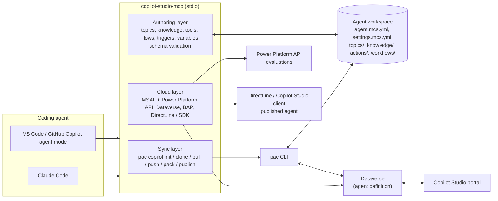
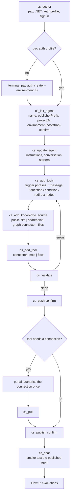
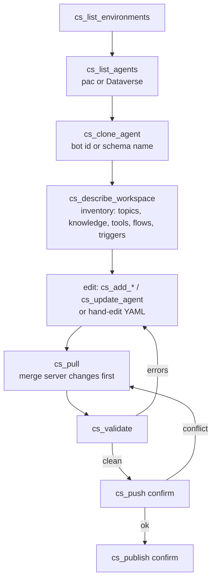
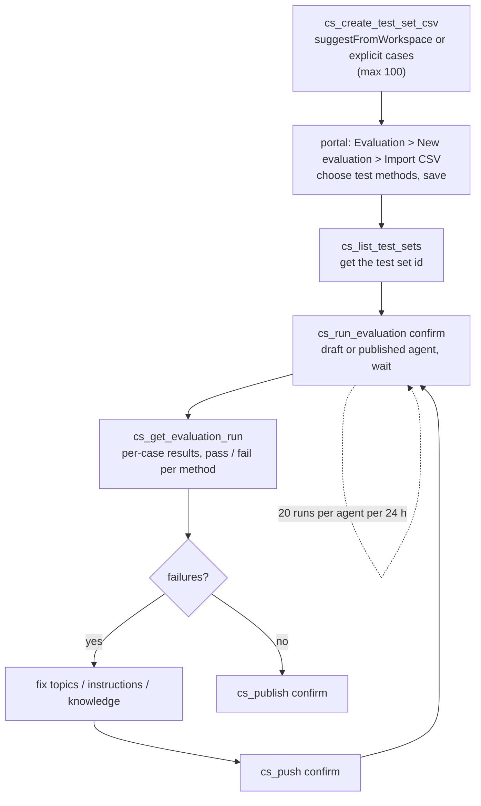
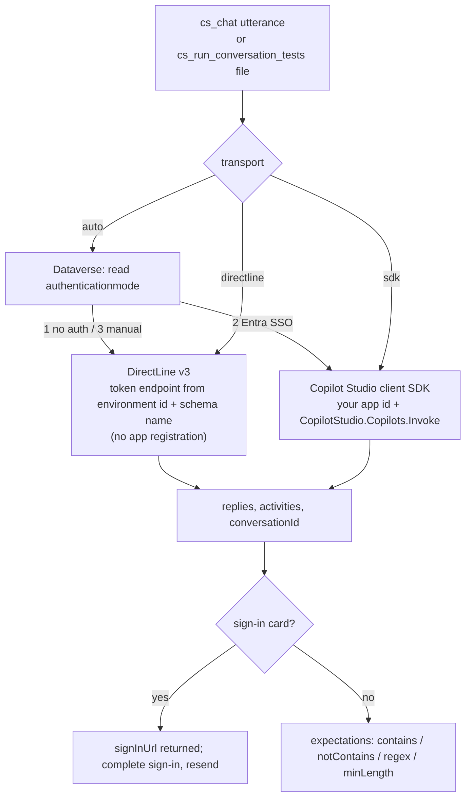
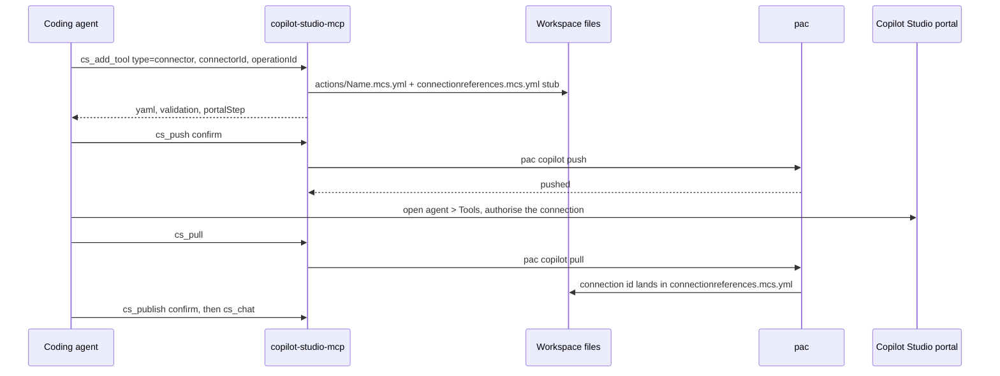
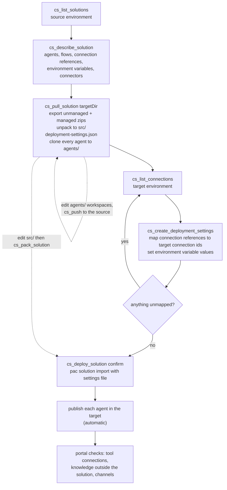
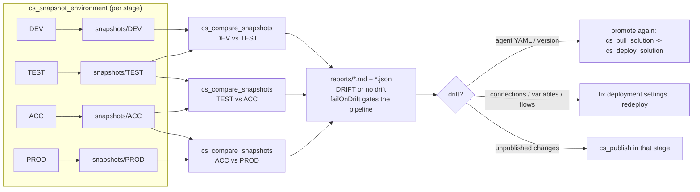
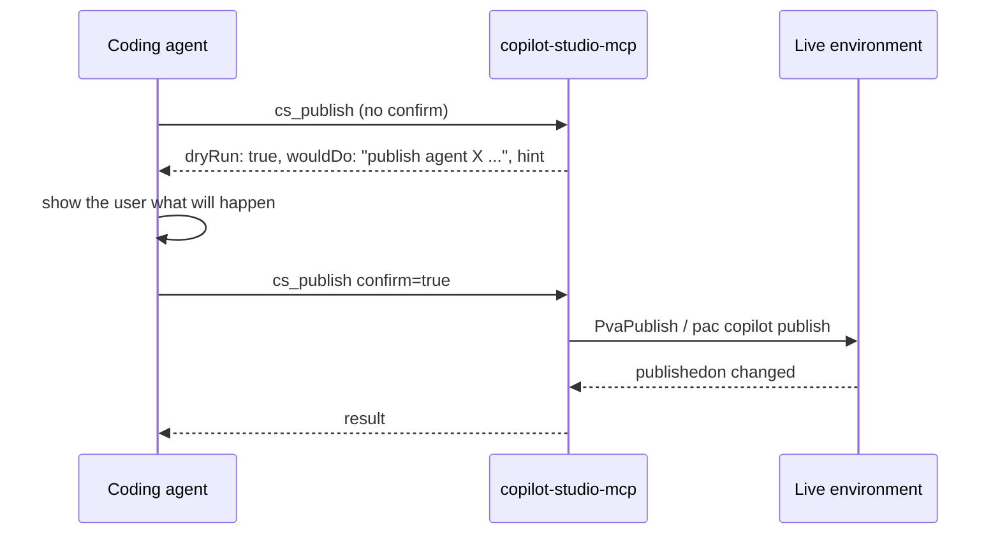

# Flows: building Copilot Studio agents through this MCP

Diagrams are Mermaid; GitHub renders them inline. Tool names are the MCP tools from the README.
Steps marked **confirm** only run when called with `confirm: true`; otherwise they return a dry run.

## Architecture

## Flow 1: new agent from scratch (standard harness)

Without `environment`, `cs_init_agent` scaffolds locally and `cs_pack` + `cs_import_solution` deploy
it; on that path only settings, agent and topics are packaged (verified with pac 2.11.2), so add
knowledge and tools after cloning the imported agent.

## Flow 2: existing agent

## Flow 3: evaluation loop

The evaluation API can list and run test sets but not create them, so the import happens once in the
portal; every later run is automated.

## Flow 4: chat-testing a published agent

## Flow 5: adding a tool that needs a connection

## Flow 6: pull a whole solution and redeploy it 1:1

Solution export/import is the vehicle for moving between environments; per-agent sync workspaces
stay bound to their source environment.

## Flow 7: compare environments in a DTAP pipeline

`cs_compare_environments` runs the whole chain in one call.

## The confirm contract

