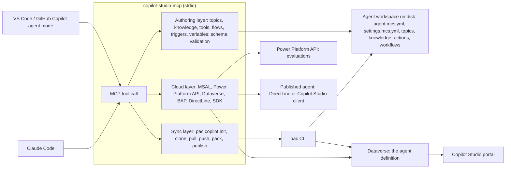
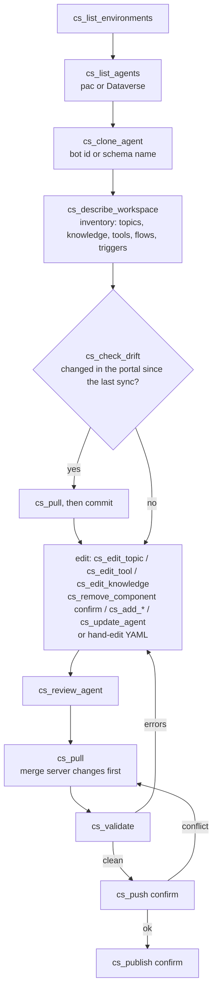
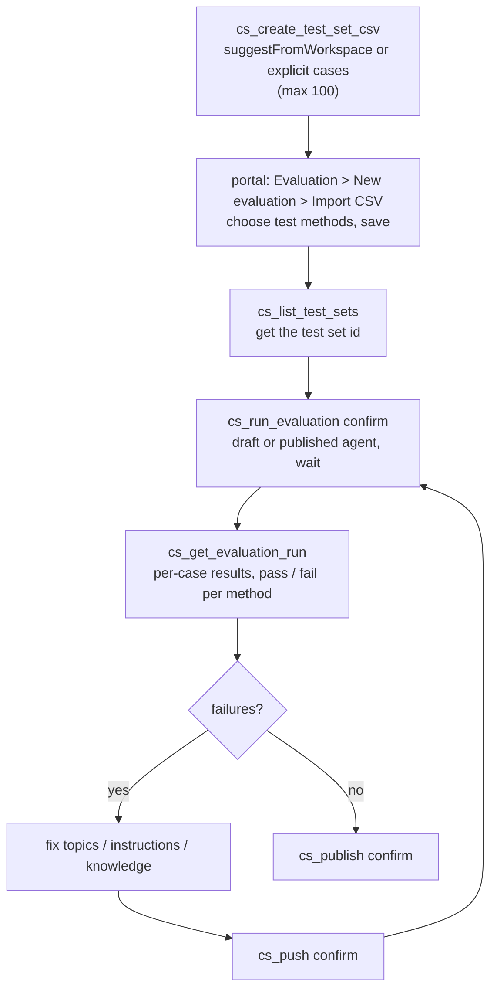
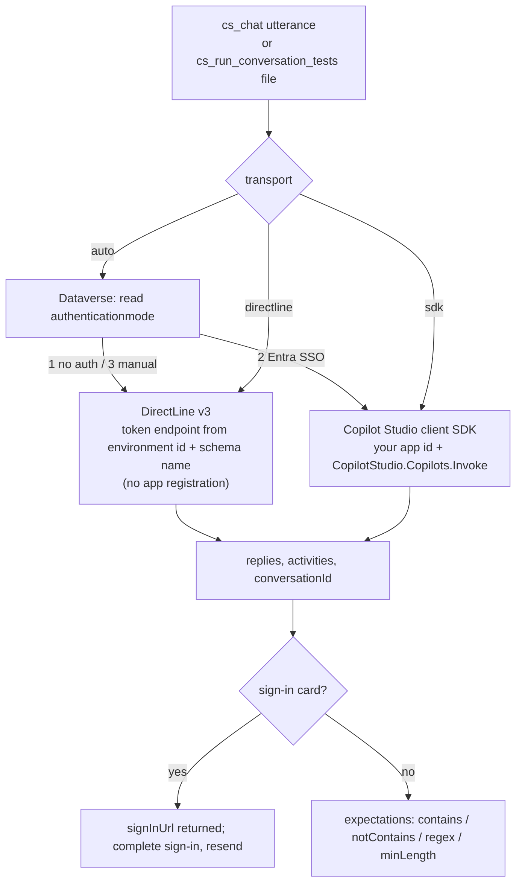
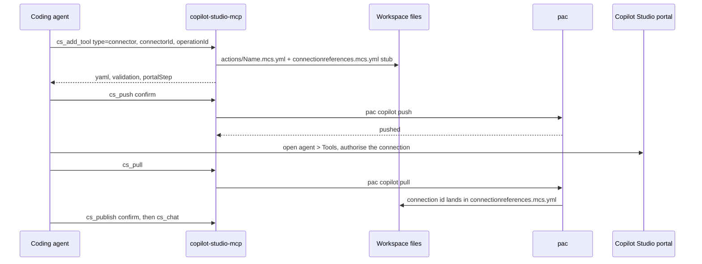
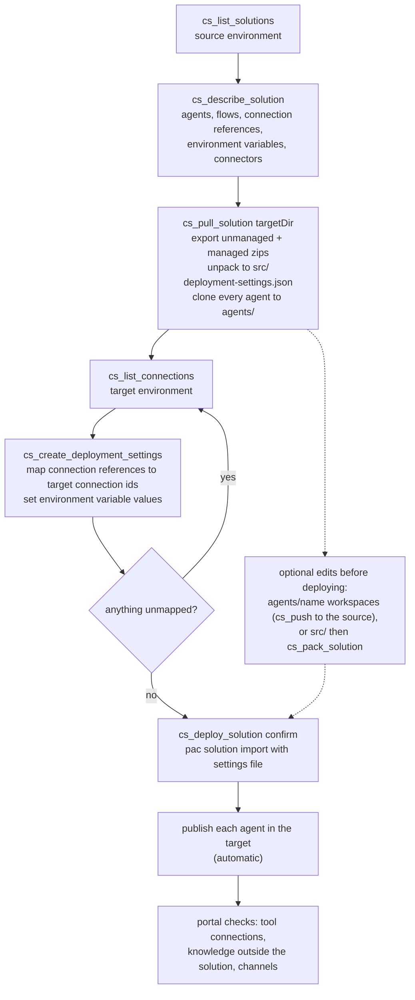
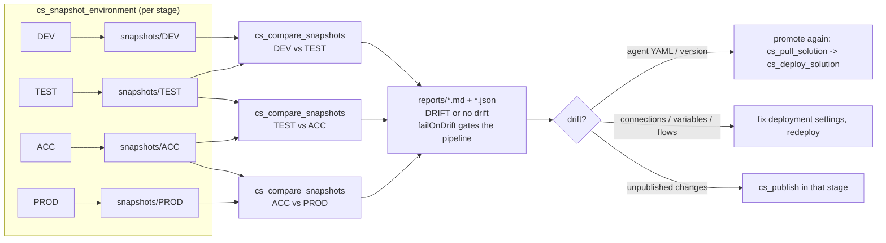
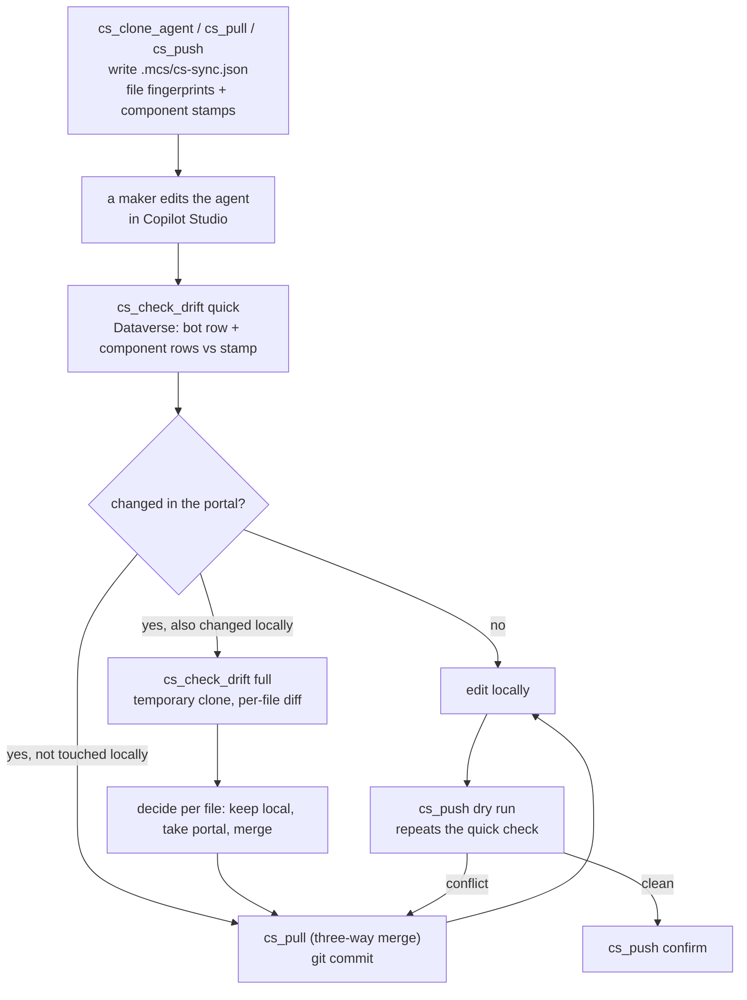
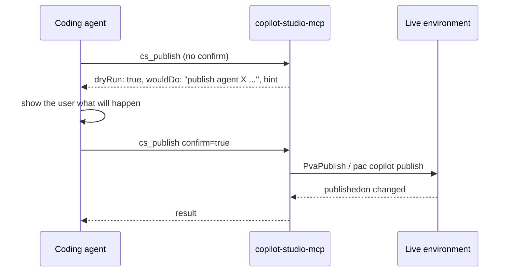

# Flows: building Copilot Studio agents through this MCP

Diagrams are Mermaid; GitHub renders them inline. Tool names are the MCP tools listed in [tools.md](tools.md); the README describes the workflows.
Steps marked **confirm** only run when called with `confirm: true`; otherwise they return a dry run.

## Architecture

## Flow 1: new agent from scratch (standard harness)

```mermaid
flowchart TD
    A["cs_init<br/>pac, .NET, auth profile, sign-in"] --> B{"pac auth profile?"}
    B -- no --> B1["terminal: pac auth create --environment ID"] --> S
    B -- yes --> S["cs_list_solutions<br/>pick an unmanaged solution,<br/>or cs_create_solution confirm"]
    S --> C["cs_create_agent<br/>name, publisherPrefix, projectDir,<br/>environment + solutionName confirm<br/>(init, pack, import, clone)"]
    C --> D["cs_generate_instructions<br/>brief -> AI Builder prompt (cs_list_prompts)<br/>review, then apply"]
    D --> E["cs_add_topic<br/>trigger phrases + message / question / condition / set variable /<br/>redirect / HTTP / flow / generative answers / adaptive card / transfer / end nodes"]
    E --> F["cs_add_knowledge_source<br/>public-site | sharepoint | graph-connector | files"]
    F --> G["cs_add_tool<br/>connector | mcp | flow | prompt | agent<br/>(cs_list_connectors, cs_describe_connector)"]
    G --> R["cs_review_agent<br/>score and fixes"]
    R --> H["cs_validate"]
    H -- errors --> E
    H -- clean --> I["cs_push confirm"]
    I --> J{"tool needs a connection?"}
    J -- yes --> J1["portal: authorise the connection once"] --> J2["cs_pull"] --> K
    J -- no --> K["cs_publish confirm"]
    K --> L["cs_chat<br/>smoke-test the published agent"]
    L --> M["Flow 3: evaluations"]
```

Without `environment`, `cs_create_agent` scaffolds locally and `cs_pack` + `cs_import_solution` deploy
it; on that path only settings, agent and topics are packaged (verified with pac 2.11.2), so add
knowledge and tools after cloning the imported agent.

| Step (MCP tool) | The same action in Copilot Studio |
| --- | --- |
| `cs_init`, `pac auth create` | none in the portal; signing in to Power Platform from your machine |
| `cs_list_solutions`, `cs_create_solution` | Power Apps maker portal > Solutions: choose or create the solution the agent lives in |
| `cs_create_agent` | Copilot Studio > Create > New agent (name, publisher) inside that solution; the default system topics are created |
| `cs_generate_instructions` | Overview > Instructions, generated with AI and then reviewed |
| `cs_add_topic` | Topics > Add a topic > From blank; trigger phrases and the message, question, condition, set variable, redirect, HTTP, generative answers, adaptive card, transfer and end conversation nodes in the authoring canvas |
| `cs_add_knowledge_source` | Knowledge > Add knowledge (public website, SharePoint, Graph connector, files) |
| `cs_add_tool` | Tools > Add a tool: pick the connector action, MCP server, flow, prompt or agent |
| `cs_review_agent` | a maker's pre-publish walkthrough: instructions, escalation, tool descriptions, phrase overlap, authentication versus knowledge; no single portal page does this |
| `cs_validate` | the validation the portal runs when you save a node or topic |
| `cs_push` | Save: the draft agent in the portal reflects the local files |
| portal: authorise the connection | Tools > the tool > Connect: sign in to the connector once |
| `cs_pull` | refresh the local files with what the portal now holds (the connection id) |
| `cs_publish` | Publish |
| `cs_chat` | the Test pane against the published agent |

## Flow 2: existing agent

| Step (MCP tool) | The same action in Copilot Studio |
| --- | --- |
| `cs_list_environments`, `cs_list_agents` | the environment picker and the Agents list |
| `cs_clone_agent` | opening the agent and getting its full definition as files (what the VS Code extension's Clone does) |
| `cs_describe_workspace` | reading the Overview, Topics, Knowledge and Tools pages at once |
| `cs_check_drift` | reading the "modified by" line of each topic, tool and knowledge source to see what colleagues changed since you last synced (Flow 8) |
| `cs_add_*`, `cs_update_agent` | adding topics, knowledge and tools, editing instructions in the portal |
| `cs_edit_topic`, `cs_edit_tool`, `cs_edit_knowledge` | opening an existing topic, tool or knowledge source and changing its phrases, nodes, description, inputs or site |
| `cs_remove_component` | deleting a topic, knowledge source, tool, trigger or variable from the agent; unused connection references go with the tool |
| `cs_review_agent` | a maker's pre-publish walkthrough of the agent |
| `cs_pull` | picking up edits other makers made in the portal since the clone |
| `cs_delete_agent`, `cs_delete_solution` | Agents > delete; Power Apps maker portal > Solutions > delete (both behind `confirm`) |
| `cs_validate`, `cs_push` | Save |
| `cs_publish` | Publish |

## Flow 3: evaluation loop

The evaluation API can list and run test sets but not create them, so the import happens once in the
portal; every later run is automated.

The evaluation API allows 20 runs per agent per 24 hours.

| Step (MCP tool) | The same action in Copilot Studio |
| --- | --- |
| `cs_create_test_set_csv` | Evaluation > New evaluation > Single responses > Import: the CSV you would fill in by hand |
| portal import | Evaluation > Import the CSV, choose test methods, Save (the one step the API cannot do) |
| `cs_list_test_sets` | the Test sets list on the Evaluation page |
| `cs_run_evaluation` | Run on a test set (draft or published agent) |
| `cs_get_evaluation_run` | the results view: per test case, per test method, pass or fail |
| `cs_push`, `cs_publish` | Save and Publish after fixing what failed |

## Flow 4: chat-testing a published agent

| Step (MCP tool) | The same action in Copilot Studio |
| --- | --- |
| `cs_chat` | typing in the Test pane; the published agent answers through its web channel (DirectLine) or, for Entra-SSO agents, the same path a custom app uses (Copilot Studio client) |
| sign-in card | the "Sign in" card the Test pane shows for authenticated agents |
| `cs_run_conversation_tests` | repeating a scripted set of Test pane conversations and checking the answers |

## Flow 5: adding a tool that needs a connection

## Flow 6: pull a whole solution and redeploy it 1:1

Solution export/import is the vehicle for moving between environments; per-agent sync workspaces
stay bound to their source environment.

| Step (MCP tool) | The same action in Copilot Studio / Power Apps |
| --- | --- |
| `cs_list_solutions` | Power Apps maker portal > Solutions in the source environment |
| `cs_describe_solution` | opening the solution and reading its component list (agents, flows, connection references, environment variables) |
| `cs_pull_solution` | Solutions > Export solution (unmanaged and managed), plus opening each agent in Copilot Studio; the agents come down as editable workspaces |
| `cs_list_connections` | Power Automate or Power Apps > Connections in the target environment |
| `cs_create_deployment_settings` | the "Connections" and "Environment variables" pages of the Import solution wizard, filled in ahead of time |
| `cs_deploy_solution` | Solutions > Import solution in the target, then Publish on each agent in Copilot Studio |
| portal checks | Copilot Studio > agent > Tools (Connect), Knowledge, Channels in the target |

## Flow 7: compare environments in a DTAP pipeline

`cs_compare_environments` runs the whole chain in one call.

| Step (MCP tool) | The same action in Copilot Studio / Power Apps |
| --- | --- |
| `cs_snapshot_environment` | opening each agent in every environment and noting its topics, knowledge, tools and publish state; Solutions > version; Power Automate > flow state; Connections; environment variable values |
| `cs_compare_snapshots` | comparing those notes by hand between two environments (no portal feature does this) |
| `cs_compare_environments` | the same across the whole DEV, TEST, ACC, PROD chain |
| `cs_list_pipelines`, `cs_deploy_pipeline` | Power Platform pipelines: Deploy to the next stage from the pipelines app, when the tenant uses pipelines instead of solution import |
| `cs_check_solution` | Solution Checker on the exported zip before promoting |
| follow-up | promote again with the solution flow, fix deployment settings, or Publish in the stage that has unpublished changes |

## Flow 8: portal drift (changes made directly in Copilot Studio)

| Step (MCP tool) | The same action in Copilot Studio |
| --- | --- |
| sync stamp (automatic) | none; the portal keeps a modified-on and modified-by stamp per topic, tool and knowledge source |
| `cs_check_drift` quick | opening each topic, tool and knowledge source and reading its "modified by" line, plus the agent's unpublished-changes banner |
| `cs_check_drift` full | opening the agent side by side with your local files and comparing them node by node |
| `cs_pull` | taking over the portal version of what changed there, merged with your local edits |
| git commit | none; the portal has no history of who changed what over time |
| `cs_push` | Save; refused when a maker changed the same component since your last pull |

## The confirm contract

